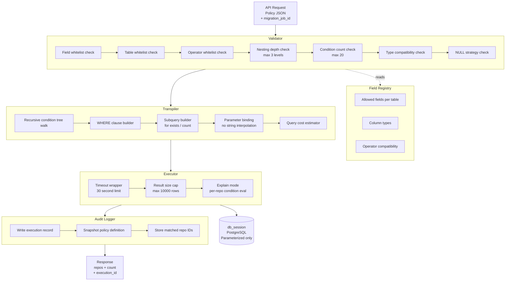

# Dynamic Policy Engine for Inventory Filtering
## Technical Design Document

**Version:** 2.0
**Date:** 2026-08-12
**Status:** Pre-Implementation Planning
**Scope:** Configurable policy engine for inventory repo filtering
with SQL transpilation, audit logging, and execution intelligence
**Authors:** Platform Migration Engineering Team

---

## 1. Problem Statement

When a migration team works with hundreds or thousands of repositories,
they need to answer operational questions before migration begins:

> *"Which repositories are large enough to need dedicated migration
> windows?"*

> *"Which repos have LFS objects over 2GB and more than 10 draft PRs?"*

> *"Show me all unprotected, non-archived repos with active issues but
> no releases."*

### The Current Pain

Today answering these questions requires:

| Step | Who | Cost |
|---|---|---|
| Migration planner identifies a filtering need | Planner | Time |
| Raises a request to engineering | Planner | Delay |
| Engineer writes a custom SQL query | Engineer | Time + cost |
| Code change deployed to expose the result | DevOps | Delay |
| Repeat cycle for every new filter requirement | Everyone | Compounding |

This process is slow, expensive, and puts non-technical migration
planners entirely at the mercy of engineering availability.

### The Business Impact

| Failure Mode | Consequence |
|---|---|
| Wrong repos included in a migration batch | Data incidents, rollbacks |
| High-risk repos missed in planning | Emergency re-architecture mid-migration |
| Filters change after sprint planning | Budget overruns, deadline slippage |
| No audit trail of what a filter returned | Compliance and traceability gaps |

**This system answers those questions without code changes — just
define or update a policy JSON and execute.**

---

## 2. Approach Selection

Three implementation approaches were evaluated before selecting the
final design.

### Option A — JSON → SQL Transpiler ✅ Selected

User defines a filter policy as structured JSON. A backend engine
validates the definition, transpiles it into parameterized SQL, and
executes it against the inventory tables.

### Option B — DSL String Parser

User writes a mini query language string:
`size_bytes > 20GB AND lfs_file_count >= 1`

Backend parses and converts to SQL.

### Option C — Pre-built Materialized Views

Common policies are encoded as database views at schema design time.
Fast reads but a new policy requires a schema migration.

### Decision Matrix

| Criterion | Option A | Option B | Option C |
|---|---|---|---|
| No code change for new policy | ✅ | ✅ | ❌ |
| Safe against SQL injection | ✅ | ⚠️ Hard to guarantee | ✅ |
| Nested logic support | ✅ | ⚠️ Complex to parse | ❌ |
| Schema validation tooling | ✅ JSON Schema standard | ⚠️ Custom parser | N/A |
| Frontend form generation | ✅ Straightforward | ❌ Very difficult | N/A |
| Cross-table conditions | ✅ | ⚠️ Very hard | ❌ |
| Audit trail per execution | ✅ | ✅ | ❌ |
| On-the-fly configuration | ✅ | ✅ | ❌ |
| Implementation complexity | Medium | High | Low |
| Long-term maintainability | High | Low | Medium |

**Verdict: Option A.**

DSL parsers are deceptively complex to make both robust and secure.
Any string parser that accepts user input and produces SQL is a SQL
injection surface that grows with every new operator added. Materialized
views cannot support on-the-fly configuration — every new policy is a
schema migration. Option A gives the best combination of safety,
flexibility, and long-term maintainability.

---

## 3. JSON vs YAML — Format Decision

The policy definitions in this system use **JSON, not YAML**.
This is an explicit architectural decision with justification.

### Comparison

| Dimension | JSON | YAML |
|---|---|---|
| API request bodies | ✅ Natural — REST APIs speak JSON | ❌ Not idiomatic for APIs |
| Database storage (JSONB) | ✅ Direct fit — PostgreSQL JSONB is native | ❌ Must serialize to store |
| Schema validation | ✅ JSON Schema is a mature, standardized spec | ⚠️ Validation tooling less consistent |
| Frontend form generation | ✅ Easy to generate from UI components | ❌ Harder to produce from UI |
| Boolean type safety | ✅ `true` is always boolean | ❌ `yes`/`on`/`true`/`True` all parse as boolean |
| Null handling | ✅ `null` is unambiguous | ⚠️ Empty value vs null ambiguity |
| Numeric type safety | ✅ `1` is integer, `1.0` is float | ⚠️ Can be ambiguous depending on parser |
| Comments | ❌ Not supported | ✅ Supported |
| Human readability | ⚠️ Verbose but unambiguous | ✅ Cleaner for complex nesting |
| Multi-line strings | ❌ Awkward | ✅ Clean block scalars |

### When YAML Would Be the Right Choice

YAML is better when policy definitions are:

- Static configuration files committed to a source repository
- Written and maintained by humans directly in a text editor
- Not stored in a relational database
- Not generated dynamically by a UI or API client

### Why JSON Wins Here

These policies are **none of those things**. They are:

- Submitted as REST API request bodies
- Stored as `JSONB` in PostgreSQL
- Potentially generated by a frontend form builder
- Validated against a JSON Schema

YAML's main advantages — readability and comments — provide no value
in this context. Its disadvantages — type coercion traps, serialization
overhead, parser inconsistencies — apply directly.

**Verdict: JSON for all policy definitions.**

---

## 4. Architecture

### 4.1 System Overview



### 4.2 Components

| **Component** | **Responsibility** |
| --- | --- |
| **Field Registry**          | Whitelist of allowed fields per table with types and operator compatibility            |
| **Validator**               | Rejects unknown fields, invalid operators, type mismatches, depth and count violations |
| **Transpiler**              | Recursive tree-walk that builds a fully parameterized WHERE clause                     |
| **Executor**                | Runs SQL with timeout enforcement, result size cap, and explain mode support           |
| **Audit Logger**            | Records every execution with policy snapshot and matched repo IDs                      |
| **API Layer**               | Accepts policy JSON, orchestrates the pipeline, returns structured response            |

---

## 5. JSON Schema Design

### 5.1 Top-Level Schema

```json
{
  "version": "1.0",
  "name": "string — required, unique identifier",
  "description": "string — required, enforced by validator",
  "category": "string — optional, for grouping and filtering",
  "tags": ["string"],
  "is_template": false,
  "extends": "string — optional, name of parent template policy",
  "null_handling": "exclude | treat_as_zero | include",
  "logic": "AND | OR",
  "conditions": [],
  "output": {
    "fields": ["name", "full_path", "size_bytes"],
    "sort_by": "size_bytes",
    "sort_dir": "asc | desc",
    "limit": 100
  }
}
```

**Field notes:**

| **Field** | **Required** | **Default** | **Notes** |
| --- | --- | --- | --- |
| **`version`**                 | Yes | —               | Enables forward compatibility as schema evolves      |
| **`name`**                    | Yes | —               | Must be unique across all saved policies             |
| **`description`**             | Yes | —               | Enforced at validator level — not optional           |
| **`category`**                | No  | **`null`**      | Used for API filtering and organisation              |
| **`tags`**                    | No  | **`[]`**        | Array of string tags for multi-faceted filtering     |
| **`is_template`**             | No  | **`false`**     | Template policies cannot be directly executed        |
| **`extends`**                 | No  | **`null`**      | Name of a template policy to inherit conditions from |
| **`null_handling`**           | No  | **`"exclude"`** | How NULL field values are treated in conditions      |
| **`logic`**                   | Yes | —               | Top-level boolean operator joining conditions        |
| **`conditions`**              | Yes | —               | Array of condition objects                           |
| **`output`**                  | No  | system default  | Controls which fields are returned and in what order |

### 5.2 Condition Types

#### Simple field condition

```json
{ "field": "size_bytes", "op": "gt", "value": 21474836 }
```

#### Nested logic group

```json
{
  "logic": "OR",
  "conditions": [
    { "field": "is_archived", "op": "eq", "value": true },
    { "field": "is_empty", "op": "eq", "value": true }
  ]
}
```

#### Cross-table EXISTS subquery

```json
{
  "op": "exists",
  "table": "inventory_protected_branches",
  "join_key": "repo_id",
  "match": [
    { "field": "code_owner_approval_required", "op": "eq", "value": true }
  ]
}
```

#### Cross-table COUNT aggregate

```json
{
  "op": "count",
  "table": "inventory_pull_requests",
  "join_key": "repo_id",
  "match": [
    { "field": "is_draft", "op": "eq", "value": true }
  ],
  "result_op": "gt",
  "result_value": 10
}
```

#### Relative value — percentile

```json
{
  "field": "size_bytes",
  "op": "gt",
  "value": { "percentile": 90 }
}
```

#### Relative value — field-to-field comparison

```json
{
  "field": "pr_count",
  "op": "gt",
  "value": { "field": "issue_count" }
}
```

### 5.3 Complete Policy Examples

#### Simple policy

```json
{
  "version": "1.0",
  "name": "large-repos-with-lfs",
  "description": "Repos over 20MB with LFS objects over 2GB",
  "category": "migration-risk",
  "tags": ["lfs", "size", "blockers"],
  "null_handling": "exclude",
  "logic": "AND",
  "conditions": [
    { "field": "size_bytes", "op": "gt", "value": 21474836 },
    { "field": "lfs_size_bytes", "op": "gt", "value": 2147483648 }
  ],
  "output": {
    "fields": ["name", "full_path", "size_bytes", "lfs_size_bytes"],
    "sort_by": "size_bytes",
    "sort_dir": "desc",
    "limit": 100
  }
}
```

#### Nested logic (OR within AND)

```json
{
  "version": "1.0",
  "name": "risky-repos",
  "description": "Archived repos OR repos with 300+ issues and no branch protection",
  "category": "migration-risk",
  "tags": ["risk", "protection", "issues"],
  "null_handling": "exclude",
  "logic": "OR",
  "conditions": [
    { "field": "is_archived", "op": "eq", "value": true },
    {
      "logic": "AND",
      "conditions": [
        { "field": "issue_count", "op": "gt", "value": 300 },
        { "field": "protected_branch_count", "op": "eq", "value": 0 }
      ]
    }
  ]
}
```

#### Policy with cross-table conditions

```json
{
  "version": "1.0",
  "name": "repos-with-code-owner-rules",
  "description": "Active repos where at least one branch requires code owner approval",
  "category": "compliance",
  "tags": ["code-owners", "branch-protection"],
  "null_handling": "exclude",
  "logic": "AND",
  "conditions": [
    { "field": "is_archived", "op": "eq", "value": false },
    {
      "op": "exists",
      "table": "inventory_protected_branches",
      "join_key": "repo_id",
      "match": [
        { "field": "code_owner_approval_required", "op": "eq", "value": true }
      ]
    }
  ]
}
```

#### Policy using a named template

```json
{
  "version": "1.0",
  "name": "active-repos-with-many-draft-prs",
  "description": "Active repos with more than 10 open draft PRs",
  "extends": "base-active-repo",
  "null_handling": "exclude",
  "logic": "AND",
  "conditions": [
    {
      "op": "count",
      "table": "inventory_pull_requests",
      "join_key": "repo_id",
      "match": [
        { "field": "is_draft", "op": "eq", "value": true }
      ],
      "result_op": "gt",
      "result_value": 10
    }
  ]
}
```

Where **`base-active-repo`** is a saved template policy:

```json
{
  "version": "1.0",
  "name": "base-active-repo",
  "description": "Baseline: non-archived, non-empty repositories",
  "is_template": true,
  "logic": "AND",
  "conditions": [
    { "field": "is_archived", "op": "eq", "value": false },
    { "field": "is_empty", "op": "eq", "value": false }
  ]
}
```

#### Policy with percentile-based threshold

```json
{
  "version": "1.0",
  "name": "top-10-percent-by-size",
  "description": "Repos in the top 10% by size within this migration job",
  "category": "migration-risk",
  "tags": ["size", "percentile"],
  "null_handling": "exclude",
  "logic": "AND",
  "conditions": [
    {
      "field": "size_bytes",
      "op": "gt",
      "value": { "percentile": 90 }
    }
  ]
}
```

---

## 6. Supported Operators

| **Operator** | **SQL Equivalent** | **Applies To** |
| --- | --- | --- |
| **`eq`**                             | **`= :val`**                 | All types                 |
| **`neq`**                            | **`!= :val`**                | All types                 |
| **`gt`**                             | **`> :val`**                 | Numeric, datetime         |
| **`gte`**                            | **`>= :val`**                | Numeric, datetime         |
| **`lt`**                             | **`< :val`**                 | Numeric, datetime         |
| **`lte`**                            | **`<= :val`**                | Numeric, datetime         |
| **`in`**                             | **`= ANY(:val)`**            | Lists                     |
| **`not_in`**                         | **`!= ALL(:val)`**           | Lists                     |
| **`is_null`**                        | **`IS NULL`**                | All types (value ignored) |
| **`not_null`**                       | **`IS NOT NULL`**            | All types (value ignored) |
| **`contains`**                       | **`ILIKE '%val%'`**          | Text                      |
| **`starts_with`**                    | **`ILIKE 'val%'`**           | Text                      |
| **`exists`**                         | **`EXISTS (SELECT 1 ...)`**  | Cross-table               |
| **`count`**                          | Subquery with **`COUNT(*)`** | Cross-table aggregate     |

---

## 7. Field Registry

### 7.1 inventory\_repos (primary table)

| **Field** | **Type** | **Example Use** |
| --- | --- | --- |
| **`size_bytes`**             | BIGINT  | Repos over 20MB         |
| **`lfs_size_bytes`**         | BIGINT  | LFS over 2GB            |
| **`lfs_file_count`**         | INTEGER | Has LFS files           |
| **`total_repo_size_bytes`**  | BIGINT  | Total size threshold    |
| **`branch_count`**           | INTEGER | Many branches           |
| **`tag_count`**              | INTEGER | Many tags               |
| **`commit_count`**           | INTEGER | Large history           |
| **`pr_count`**               | INTEGER | Active repos            |
| **`issue_count`**            | INTEGER | Issue-heavy repos       |
| **`label_count`**            | INTEGER | Labels                  |
| **`release_count`**          | INTEGER | Release frequency       |
| **`milestone_count`**        | INTEGER | Milestone tracking      |
| **`protected_branch_count`** | INTEGER | Has protection rules    |
| **`protected_tag_count`**    | INTEGER | Has tag protection      |
| **`submodule_count`**        | INTEGER | Has submodules          |
| **`is_archived`**            | BOOLEAN | Archived repos          |
| **`is_fork`**                | BOOLEAN | Forked repos            |
| **`is_private`**             | BOOLEAN | Private repos           |
| **`is_empty`**               | BOOLEAN | Empty repos             |
| **`primary_language`**       | TEXT    | Language filter         |
| **`visibility`**             | TEXT    | public/private/internal |
| **`name`**                   | TEXT    | Name pattern match      |
| **`full_path`**              | TEXT    | Path pattern match      |

### 7.2 Cross-table targets (for exists/count)

| **Table** | **Join Key** | **Available Fields** |
| --- | --- | --- |
| **`inventory_protected_branches`** | **`repo_id`** | **`name`**, **`allow_force_push`**, **`code_owner_approval_required`** |
| **`inventory_protected_tags`**     | **`repo_id`** | **`name`**                                                             |
| **`inventory_pull_requests`**      | **`repo_id`** | **`state`**, **`is_draft`**, **`author_username`**                     |
| **`inventory_issues`**             | **`repo_id`** | **`state`**, **`author_username`**                                     |
| **`inventory_labels`**             | **`repo_id`** | **`name`**, **`color`**                                                |
| **`inventory_lfs`**                | **`repo_id`** | **`size`**, **`file_path`**                                            |
| **`inventory_submodules`**         | **`repo_id`** | **`path`**, **`url`**                                                  |
| **`inventory_branches`**           | **`repo_id`** | **`name`**, **`is_protected`**, **`is_default`**                       |
| **`inventory_milestones`**         | **`repo_id`** | **`state`**, **`title`**                                               |

---

## 8. SQL Generation

### 8.1 Simple Conditions

**Input:**

```json
{
  "null_handling": "exclude",
  "logic": "AND",
  "conditions": [
    { "field": "size_bytes", "op": "gt", "value": 21474836 },
    { "field": "is_archived", "op": "eq", "value": false },
    { "field": "lfs_file_count", "op": "gte", "value": 1 }
  ]
}
```

**Generated SQL:**

```sql
SELECT source_id, name, full_path, size_bytes, lfs_size_bytes, lfs_file_count
FROM git_lift.inventory_repos
WHERE migration_job_id = :job_id
  AND size_bytes IS NOT NULL AND size_bytes > :p0
  AND is_archived IS NOT NULL AND is_archived = :p1
  AND lfs_file_count IS NOT NULL AND lfs_file_count >= :p2
```

Parameters: **`{ p0: 21474836, p1: false, p2: 1 }`**

The **`IS NOT NULL`** guards are injected automatically when
**`null_handling`** is **`"exclude"`** (the default).

### 8.2 Cross-table EXISTS

**Input condition:**

```json
{
  "op": "exists",
  "table": "inventory_protected_branches",
  "join_key": "repo_id",
  "match": [{ "field": "allow_force_push", "op": "eq", "value": true }]
}
```

**Generated SQL fragment:**

```sql
AND EXISTS (
  SELECT 1 FROM git_lift.inventory_protected_branches sub
  WHERE sub.repo_id = inventory_repos.source_id
    AND sub.allow_force_push = :p3
)
```

### 8.3 COUNT Aggregate

**Input condition:**

```json
{
  "op": "count",
  "table": "inventory_pull_requests",
  "join_key": "repo_id",
  "match": [{ "field": "is_draft", "op": "eq", "value": true }],
  "result_op": "gt",
  "result_value": 10
}
```

**Generated SQL fragment:**

```sql
AND (
  SELECT COUNT(*) FROM git_lift.inventory_pull_requests sub
  WHERE sub.repo_id = inventory_repos.source_id
    AND sub.is_draft = :p4
) > :p5
```

### 8.4 Percentile-based Relative Value

**Input condition:**

```json
{ "field": "size_bytes", "op": "gt", "value": { "percentile": 90 } }
```

**Generated SQL fragment:**

```sql
AND size_bytes > (
  SELECT PERCENTILE_CONT(0.90) WITHIN GROUP (ORDER BY size_bytes)
  FROM git_lift.inventory_repos
  WHERE migration_job_id = :job_id
)
```

### 8.5 Field-to-Field Comparison

**Input condition:**

```json
{ "field": "pr_count", "op": "gt", "value": { "field": "issue_count" } }
```

**Generated SQL fragment:**

```sql
AND pr_count > issue_count
```

The referenced field is validated against the field whitelist at
transpile time.

---

## 9. NULL Handling Strategy

### 9.1 The Problem

In SQL, any comparison against **`NULL`** evaluates to **`NULL`** — not **`TRUE`**
or **`FALSE`**. This means a condition like **`lfs_file_count >= 1`** will
silently exclude repos where **`lfs_file_count`** is **`NULL`** (ingestion not
yet complete), which may or may not be the intended behaviour.

Leaving this implicit causes silent production bugs that are very hard
to diagnose.

### 9.2 The Resolution

Every policy must declare a **`null_handling`** strategy. The default is
**`"exclude"`**. Three strategies are supported:

| **Strategy** | **Behaviour** | **SQL Effect** |
| --- | --- | --- |
| **`exclude`**                   | NULL fields never match                 | **`AND field IS NOT NULL`** prepended    |
| **`treat_as_zero`**             | NULL treated as zero for numeric fields | **`COALESCE(field, 0)`** wraps the field |
| **`include`**                   | NULL fields always match                | **`OR field IS NULL`** appended          |

### 9.3 Generated SQL Per Strategy

**`null_handling: "exclude"`** (default):

```sql
AND lfs_file_count IS NOT NULL AND lfs_file_count >= :p0
```

**`null_handling: "treat_as_zero"`**:

```sql
AND COALESCE(lfs_file_count, 0) >= :p0
```

**`null_handling: "include"`**:

```sql
AND (lfs_file_count >= :p0 OR lfs_file_count IS NULL)
```

### 9.4 Guidance

| **Use Case** | **Recommended Strategy** |
| --- | --- |
| Production migration batches           | **`exclude`** — do not include repos with incomplete data      |
| Size estimation with partial ingestion | **`treat_as_zero`** — include all repos, count missing as zero |
| Finding repos not yet ingested         | **`include`** — explicitly surface incomplete repos            |

---

## 10. Enhancements

The following capabilities address gaps identified during design review.
Each enhancement includes a problem statement and its solution.

---

### 10.1 Policy Execution Audit Log

**Problem:**
No record exists of what a policy returned at a given point in time.
A team plans migration work based on 243 repos on Monday. Someone
modifies the policy on Wednesday. The result is now 180 repos. The
original result and the reason for the change are both lost.

**Solution:**

Every execution writes a record to **`inventory_policy_executions`**
containing the policy definition snapshot, matched repo count, and
matched repo IDs at that point in time.

```sql
CREATE TABLE IF NOT EXISTS git_lift.inventory_policy_executions (
    id               UUID PRIMARY KEY DEFAULT gen_random_uuid(),
    policy_id        UUID REFERENCES git_lift.inventory_policies(id),
    migration_job_id UUID NOT NULL,
    policy_snapshot  JSONB NOT NULL,
    repo_count       INTEGER NOT NULL,
    executed_at      TIMESTAMPTZ NOT NULL DEFAULT NOW(),
    executed_by      TEXT,
    result_repo_ids  UUID[],
    dry_run          BOOLEAN DEFAULT FALSE,
    execution_ms     INTEGER
);
```

This enables:

- Full audit trail of every policy execution
- Answering "what did this policy return last Tuesday"
- Diffing two executions to detect data or policy drift

**API access:**

```
GET /api/v1/policies/{policy_id}/executions
Response: { "executions": [ { "id": "...", "repo_count": 243,
            "executed_at": "...", "dry_run": false } ] }
```

---

### 10.2 Dry Run Mode

**Problem:**
Teams had no way to validate a policy before running it against a real
migration job. The only way to see if the logic was correct was to
execute it and observe the result.

**Solution:**
Add **`"dry_run": true`** to any execute request. The executor runs
**`COUNT(*)`** only — no full **`SELECT`**, no result rows returned. The
generated SQL and parameter bindings are shown so teams can verify
the logic before committing.

**Request:**

```json
{
  "migration_job_id": "uuid-...",
  "logic": "AND",
  "conditions": [
    { "field": "size_bytes", "op": "gt", "value": 21474836 }
  ],
  "dry_run": true
}
```

**Response:**

```json
{
  "dry_run": true,
  "generated_sql": "SELECT COUNT(*) FROM git_lift.inventory_repos WHERE ...",
  "parameters": { "p0": 21474836 },
  "estimated_count": 42,
  "validation_errors": [],
  "estimated_cost": {
    "subquery_count": 0,
    "cross_table_joins": 0,
    "risk": "LOW"
  }
}
```

The **`estimated_cost`** block is produced by the cost estimator before
any SQL runs. A policy with **`risk: "HIGH"`** in dry run is a strong
signal to restructure the conditions.

---

### 10.3 Named Condition Templates

**Problem:**
Every policy must fully redefine all its conditions. If ten policies
all start with **`is_archived = false AND is_empty = false`**, that logic
is duplicated across ten JSON blobs and must be kept in sync manually.

**Solution:**
A policy can declare **`"extends": "<template-name>"`**. The transpiler
merges the parent template's conditions into the child policy before
building SQL.

**Template definition:**

```json
{
  "version": "1.0",
  "name": "base-active-repo",
  "description": "Baseline: non-archived, non-empty repositories",
  "is_template": true,
  "logic": "AND",
  "conditions": [
    { "field": "is_archived", "op": "eq", "value": false },
    { "field": "is_empty", "op": "eq", "value": false }
  ]
}
```

**Child policy:**

```json
{
  "version": "1.0",
  "name": "active-repos-with-lfs",
  "description": "Active repos with at least one LFS file",
  "extends": "base-active-repo",
  "logic": "AND",
  "conditions": [
    { "field": "lfs_file_count", "op": "gte", "value": 1 }
  ]
}
```

**Effective conditions after merge:**

```json
[
  { "field": "is_archived", "op": "eq", "value": false },
  { "field": "is_empty", "op": "eq", "value": false },
  { "field": "lfs_file_count", "op": "gte", "value": 1 }
]
```

**Rules:**

- Template policies cannot be directly executed
- A template cannot extend another template (max inheritance depth: 1)
- Child conditions are always appended — child cannot override parent

---

### 10.4 Output Control Block

**Problem:**
Output format was unspecified in v1.0. Callers either received too
much data or had to add pagination and field selection ad hoc for
every request.

**Solution:**
An **`output`** block in the policy schema controls which fields are
returned, in what order, and with what limit.

```json
{
  "output": {
    "fields": ["name", "full_path", "size_bytes", "lfs_size_bytes"],
    "sort_by": "size_bytes",
    "sort_dir": "desc",
    "limit": 100
  }
}
```

| **Key** | **Type** | **Default** | **Notes** |
| --- | --- | --- | --- |
| **`fields`**            | string[] | **`["source_id", "name", "full_path", "size_bytes"]`** | Must be in field whitelist               |
| **`sort_by`**           | string   | **`"name"`**                                           | Must be in field whitelist               |
| **`sort_dir`**          | string   | **`"asc"`**                                            | **`asc`** or **`desc`**                  |
| **`limit`**             | integer  | **`500`**                                              | Hard max of 10,000 enforced at API level |

If **`limit`** exceeds 10,000, the API returns the first 10,000 rows
with **`"truncated": true`** in the response.

---

### 10.5 Policy Tags and Categories

**Problem:**
No mechanism existed to organise or discover saved policies.
At 50+ saved policies, finding the right one becomes a manual search.

**Solution:**
Policies support a **`category`** string and a **`tags`** array. Both are
stored in the database and exposed as API filter parameters.

**Policy definition:**

```json
{
  "name": "large-repos-with-lfs",
  "category": "migration-risk",
  "tags": ["lfs", "size", "blockers"]
}
```

**Storage additions:**

```sql
ALTER TABLE git_lift.inventory_policies
  ADD COLUMN tags     TEXT[] DEFAULT '{}',
  ADD COLUMN category TEXT;

CREATE INDEX idx_policies_category
  ON git_lift.inventory_policies (category);

CREATE INDEX idx_policies_tags
  ON git_lift.inventory_policies USING GIN (tags);
```

**API filtering:**

```
GET /api/v1/policies?category=migration-risk&tags=lfs,blockers
```

---

### 10.6 Condition-Level Explanation

**Problem:**
When a policy returns a repo, teams had no way to see which specific
conditions caused the match. Debugging unexpected results required
manual SQL queries.

**Solution:**
Add **`"explain": true`** to any execute request. The executor runs each
condition independently per matched repo and returns the actual value
and pass/fail result alongside the threshold.

**Request addition:**

```json
{ "migration_job_id": "...", "conditions": [...], "explain": true }
```

**Response addition per repo:**

```json
{
  "repo_id": "abc-123",
  "name": "my-large-repo",
  "matched": true,
  "explanation": [
    {
      "field": "size_bytes",
      "op": "gt",
      "threshold": 21474836,
      "actual": 524288000,
      "passed": true
    },
    {
      "field": "lfs_file_count",
      "op": "gte",
      "threshold": 1,
      "actual": 47,
      "passed": true
    }
  ]
}
```

Explanation mode is opt-in only. It executes each condition as an
independent sub-evaluation per repo and is more expensive than a
single WHERE clause. Use for debugging, not production batch runs.

---

### 10.7 Policy Conflict Detection

**Problem:**
Two policies might overlap significantly — processing the same repos
twice under different names — without the team realising it. This
leads to double-counting in planning and inconsistent migration batch
assignments.

**Solution:**
A compare endpoint executes both policies against the same migration
job and computes the set intersection at the database level.

**Request:**

```
POST /api/v1/policies/compare
Body: {
  "policy_a_id": "uuid-1",
  "policy_b_id": "uuid-2",
  "migration_job_id": "uuid-job"
}
```

Implemented as a database-level set intersection between two
independently executed parameterized queries. No additional
infrastructure required.

---

### 10.8 Relative Value Conditions

**Problem:**
All condition values were hardcoded absolute numbers. Migration
planning frequently requires dynamic thresholds such as "the top
10% of repos by size" or "repos with more PRs than issues".
Hardcoded thresholds break when repository inventory characteristics
change across different customer environments.

**Solution:**
The **`value`** field in a condition can be a relative reference instead
of a literal.

**Percentile-based:**

```json
{ "field": "size_bytes", "op": "gt", "value": { "percentile": 90 } }
```

Transpiles to:

```sql
AND size_bytes > (
  SELECT PERCENTILE_CONT(0.90) WITHIN GROUP (ORDER BY size_bytes)
  FROM git_lift.inventory_repos
  WHERE migration_job_id = :job_id
)
```

**Field-to-field:**

```json
{ "field": "pr_count", "op": "gt", "value": { "field": "issue_count" } }
```

Transpiles to:

```sql
AND pr_count > issue_count
```

**Validation rules:**

- Percentile must be a number between 1 and 99
- The field referenced in a field-to-field condition must be in the
  field whitelist
- Field-to-field comparison only allowed between fields of the same
  type

---

### 10.9 Query Cost Estimation

**Problem:**
Multiple EXISTS and COUNT subqueries compose multiplicatively in
execution cost. Five correlated subqueries against a 100,000-repo
inventory table can produce a query that takes minutes, blocking
the database for other users.

**Solution:**
The transpiler estimates query cost before any SQL is executed and
rejects queries above the threshold.

**Cost model:**

| **Factor** | **Cost Points** |
| --- | --- |
| Simple field condition | 1  |
| EXISTS subquery        | 10 |
| COUNT subquery         | 15 |
| Percentile calculation | 20 |

**Thresholds:**

| **Total Cost** | **Risk Level** | **Action** |
| --- | --- | --- |
| 0–20                           | LOW      | Execute normally                                  |
| 21–50                          | MEDIUM   | Execute with warning in response                  |
| 51–80                          | HIGH     | Require **`"force": true`** in request to execute |
| 81+                            | CRITICAL | Reject — return 400 with restructuring guidance   |

**Cost estimate included in dry run response:**

```json
{
  "estimated_cost": {
    "total_points": 27,
    "breakdown": {
      "simple_conditions": 2,
      "exists_subqueries": 1,
      "count_subqueries": 1
    },
    "risk": "MEDIUM",
    "warning": "This query contains cross-table subqueries. Consider
                adding selective simple conditions first to reduce
                the working set."
  }
}
```

---

### 10.10 Execution Timeout and Result Size Cap

**Problem:**
No runtime protection existed against runaway queries or accidental
full-table scans returning hundreds of thousands of rows.

**Solution:**

**Execution timeout:**
Every query runs inside a 30-second timeout wrapper. If the limit is
exceeded, the executor cancels the query and returns HTTP 408 with:

```json
{
  "error": "execution_timeout",
  "message": "Query exceeded the 30-second execution limit.",
  "suggestion": "Add more selective conditions to reduce the working
                 set, or use dry_run mode to estimate cost first."
}
```

**Result size cap:**
Maximum 10,000 rows returned in a single response. If the query
matches more, the first 10,000 are returned with:

```json
{
  "count": 10000,
  "truncated": true,
  "total_matched": 47283,
  "message": "Results truncated at 10,000. Refine your policy
              conditions or use pagination to retrieve all results."
}
```

---

### 10.11 Rate Limiting

**Problem:**
Policy execution against large inventory tables is a compute-intensive
operation. Without rate limiting, a single user could issue concurrent
requests that saturate the database.

**Solution:**
Maximum 10 policy executions per user per minute. Exceeded requests
return HTTP 429:

```json
{
  "error": "rate_limit_exceeded",
  "retry_after_seconds": 23
}
```

---

## 11. Security Boundaries

### 11.1 Structural Protections (Validation Layer)

| **Protection** | **Detail** | **Why** |
| --- | --- | --- |
| Field whitelist         | Only known column names from the Field Registry are accepted      | Prevents column injection and schema probing                                 |
| Table whitelist         | Only known inventory tables accepted for **`exists`**/**`count`** | Prevents access to non-inventory tables                                      |
| Operator whitelist      | Only the 14 defined operators accepted                            | Prevents SQL operator injection                                              |
| Parameterized values    | Values are never string-interpolated into SQL                     | Eliminates SQL injection at the value level                                  |
| Max nesting depth: 3    | Logic groups cannot exceed 3 levels                               | Beyond 3 levels the policy is unmaintainable and the SQL becomes unindexable |
| Max conditions: 20      | No more than 20 conditions per policy                             | Prevents accidental or malicious generation of enormous query strings        |
| Field type enforcement  | Numeric operators rejected on text fields                         | Prevents nonsensical comparisons                                             |
| Template max depth: 1   | A template cannot extend another template                         | Prevents circular references and deep inheritance chains                     |

### 11.2 Runtime Protections (Executor Layer)

| **Protection** | **Detail** | **Why** |
| --- | --- | --- |
| Query cost estimation   | Counts subquery cost points before execution | Prevents expensive queries from reaching the database |
| Execution timeout: 30s  | Hard limit per query                         | Prevents runaway queries from blocking the database   |
| Result size cap: 10,000 | Maximum rows per response                    | Prevents accidental full-table streaming              |
| Rate limiting: 10/min   | Per user per minute                          | Prevents resource exhaustion from concurrent requests |

### 11.3 Why These Specific Limits

**Max nesting depth of 3:**
A WHERE clause with more than 3 levels of nested boolean logic cannot
be indexed efficiently by PostgreSQL. It also cannot be understood or
maintained by a human reviewer. If a use case genuinely requires
deeper nesting, it should be decomposed into multiple named policies
with explicit intent.

**Max 20 conditions:**
A policy with more than 20 conditions is doing too much. It is a signal
that the policy should be split into multiple named policies with
clear, separate intent. It also prevents malicious construction of
extremely large query strings designed to probe or exhaust the system.

**30-second timeout:**
PostgreSQL **`statement_timeout`** is set at the session level for every
policy execution query. This is enforced at the database level, not
just the application level, so it cannot be bypassed by a slow network
or a hung connection.

---

## 12. API Design

### Save a policy

```
POST /api/v1/policies
Body: { <full policy JSON> }

Response 201:
{ "id": "uuid", "name": "...", "created_at": "..." }

Response 400:
{ "error": "validation_failed", "details": [
    { "field": "conditions[0].field", "message": "Unknown field: bad_col" }
  ]
}
```

### Update a policy

```
PUT /api/v1/policies/{policy_id}
Body: { <updated policy JSON> }

Response 200: { "id": "uuid", "name": "...", "updated_at": "..." }
```

### Execute a policy (ad-hoc)

```
POST /api/v1/policies/execute
Body: {
  "migration_job_id": "uuid",
  "logic": "AND",
  "conditions": [...],
  "dry_run": false,
  "explain": false
}

Response 200: {
  "count": 42,
  "truncated": false,
  "execution_id": "uuid",
  "repos": [...]
}
```

### Execute a saved policy

```
POST /api/v1/policies/{policy_id}/execute
Body: { "migration_job_id": "uuid", "dry_run": false, "explain": false }

Response 200: { "count": 42, "execution_id": "uuid", "repos": [...] }
```

### List saved policies

```
GET /api/v1/policies?category=migration-risk&tags=lfs,blockers

Response 200: {
  "policies": [
    { "id": "uuid", "name": "...", "category": "...", "tags": [...] }
  ]
}
```

### Get execution history

```
GET /api/v1/policies/{policy_id}/executions

Response 200: {
  "executions": [
    {
      "id": "uuid",
      "repo_count": 243,
      "executed_at": "2026-08-12T09:00:00Z",
      "executed_by": "user@example.com",
      "dry_run": false
    }
  ]
}
```

### Compare two policies

```
POST /api/v1/policies/compare
Body: {
  "policy_a_id": "uuid-1",
  "policy_b_id": "uuid-2",
  "migration_job_id": "uuid-job"
}

Response 200: {
  "policy_a_name": "large-repos-with-lfs",
  "policy_a_count": 54,
  "policy_b_name": "risky-repos",
  "policy_b_count": 46,
  "overlap_count": 34,
  "only_in_a": 20,
  "only_in_b": 12,
  "overlap_percentage": 62.9,
  "overlap_repo_ids": ["uuid-a", "uuid-b"]
}
```

---

## 13. Storage Schema

```sql
-- Saved policies
CREATE TABLE IF NOT EXISTS git_lift.inventory_policies (
    id           UUID        PRIMARY KEY DEFAULT gen_random_uuid(),
    name         TEXT        NOT NULL UNIQUE,
    description  TEXT        NOT NULL,
    category     TEXT,
    tags         TEXT[]      DEFAULT '{}',
    is_template  BOOLEAN     DEFAULT FALSE,
    definition   JSONB       NOT NULL,
    created_at   TIMESTAMPTZ NOT NULL DEFAULT NOW(),
    updated_at   TIMESTAMPTZ NOT NULL DEFAULT NOW(),
    created_by   TEXT,
    updated_by   TEXT
);

-- Execution audit log
CREATE TABLE IF NOT EXISTS git_lift.inventory_policy_executions (
    id               UUID        PRIMARY KEY DEFAULT gen_random_uuid(),
    policy_id        UUID        REFERENCES git_lift.inventory_policies(id),
    migration_job_id UUID        NOT NULL,
    policy_snapshot  JSONB       NOT NULL,
    repo_count       INTEGER     NOT NULL,
    executed_at      TIMESTAMPTZ NOT NULL DEFAULT NOW(),
    executed_by      TEXT,
    result_repo_ids  UUID[],
    dry_run          BOOLEAN     DEFAULT FALSE,
    execution_ms     INTEGER
);

-- Indexes
CREATE INDEX idx_policies_category
  ON git_lift.inventory_policies (category);

CREATE INDEX idx_policies_tags
  ON git_lift.inventory_policies USING GIN (tags);

CREATE INDEX idx_policies_is_template
  ON git_lift.inventory_policies (is_template);

CREATE INDEX idx_executions_policy_id
  ON git_lift.inventory_policy_executions (policy_id);

CREATE INDEX idx_executions_migration_job
  ON git_lift.inventory_policy_executions (migration_job_id);

CREATE INDEX idx_executions_executed_at
  ON git_lift.inventory_policy_executions (executed_at DESC);

CREATE INDEX idx_repos_migration_job
  ON git_lift.inventory_repos (migration_job_id);
```

---

## 14. Real-World Policy Examples

| **Policy Name** | **Conditions** |
| --- | --- |
| Large repos needing attention     | **`size_bytes > 1GB AND pr_count > 100`**                              |
| Unprotected active repos          | **`protected_branch_count = 0 AND is_archived = false`**               |
| LFS migration risk                | **`lfs_size_bytes > 2GB OR lfs_file_count > 500`**                     |
| Stale forks                       | **`is_fork = true AND pr_count = 0 AND commit_count < 10`**            |
| Submodule complexity              | **`submodule_count > 5`**                                              |
| Milestone cleanup needed          | **`milestone_count > 20 AND exists(milestones WHERE state = closed)`** |
| Active repos with no releases     | **`pr_count > 50 AND release_count = 0`**                              |
| Code owner protected repos        | **`exists(protected_branches WHERE code_owner_approval = true)`**      |
| Top 10% by size                   | **`size_bytes > { percentile: 90 }`**                                  |
| More PRs than issues              | **`pr_count > { field: issue_count }`**                                |
| Draft-heavy repos                 | **`count(pull_requests WHERE is_draft = true) > 10`**                  |
| Repos with many closed milestones | **`exists(milestones WHERE state = closed AND milestone_count > 20)`** |

---

## 15. Performance Considerations

| **Concern** | **Recommendation** |
| --- | --- |
| **`migration_job_id`** index | Required — every query filters by this column without exception                   |
| Frequently filtered columns  | Monitor slow query log; add indexes after observing real patterns                 |
| EXISTS vs JOIN               | EXISTS is used throughout — it does not multiply rows like a JOIN does            |
| COUNT subqueries             | Each is a correlated subquery; the cost estimator gates these before execution    |
| Large result sets            | Result cap at 10,000 rows; use **`output.limit`** and pagination for full exports |
| Dry run first                | Strongly encourage for any new policy before production execution                 |
| Statement timeout            | Set **`statement_timeout = 30000`** at the session level for all policy queries   |

---

## 16. Summary of All Enhancements

| **Enhancement** | **Problem Solved** | **Priority** |
| --- | --- | --- |
| Policy execution audit log            | No record of what a policy returned at a point in time              | High   |
| Dry run mode                          | No way to validate a policy before production execution             | High   |
| Explicit NULL handling                | NULL comparison behaviour was implicit and caused silent bugs       | High   |
| Output control block                  | Output format was unspecified and uncontrolled                      | High   |
| Named condition templates             | Baseline conditions were duplicated across many policies            | Medium |
| Policy tags and categories            | No discoverability mechanism for growing policy libraries           | Medium |
| Condition-level explanation           | No visibility into which conditions caused a specific repo to match | Medium |
| Query cost estimation                 | Expensive subquery policies could reach the database unchecked      | Medium |
| Execution timeout                     | Runaway queries had no hard stop                                    | Medium |
| Result size cap                       | Accidental full-table streaming was possible                        | Medium |
| Rate limiting                         | Concurrent execution requests could exhaust database resources      | Medium |
| Policy conflict detection             | Overlapping policies caused double-counting in migration planning   | Medium |
| Relative value conditions             | Hardcoded absolute thresholds broke across different environments   | Low    |
| **`version`** field                   | No forward compatibility mechanism as schema evolves                | Low    |
| **`description`** required            | Policies without descriptions became unmaintainable                 | Low    |
| **`created_by`** / **`updated_by`**   | No ownership tracking in team environments                          | Low    |

---

*End of Technical Design Document — Dynamic Policy Engine v2.0*
