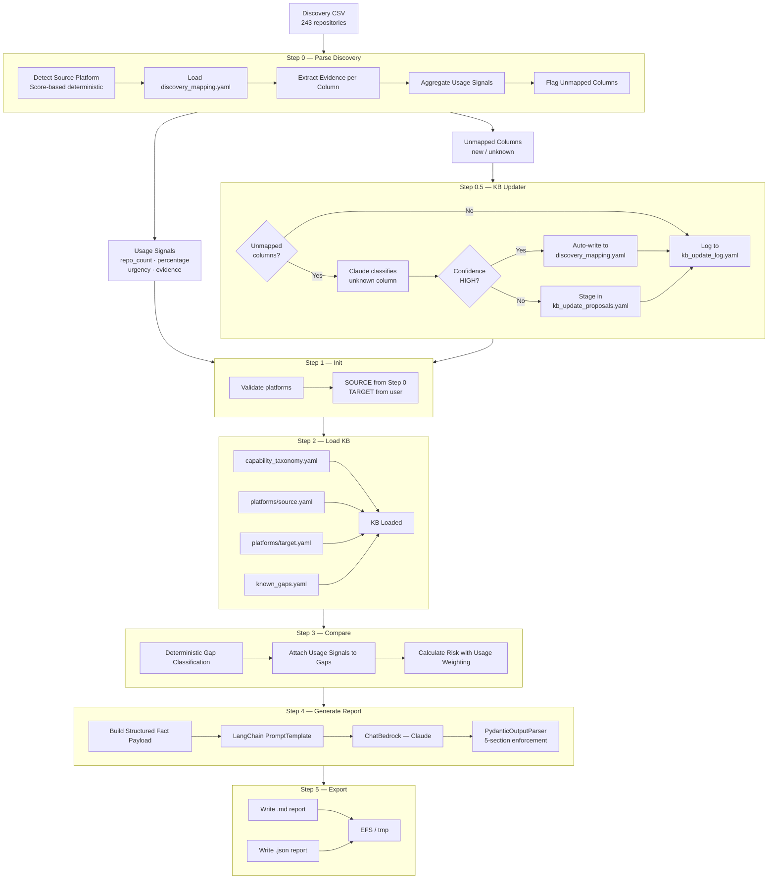
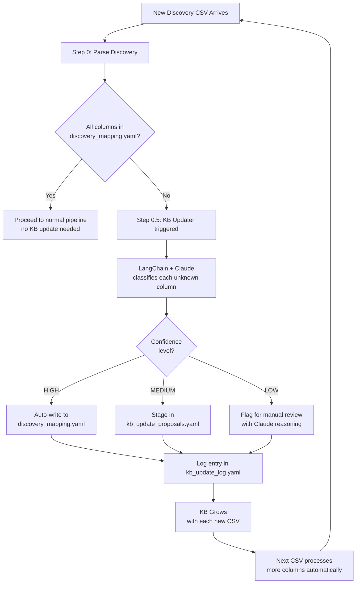
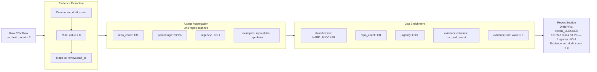
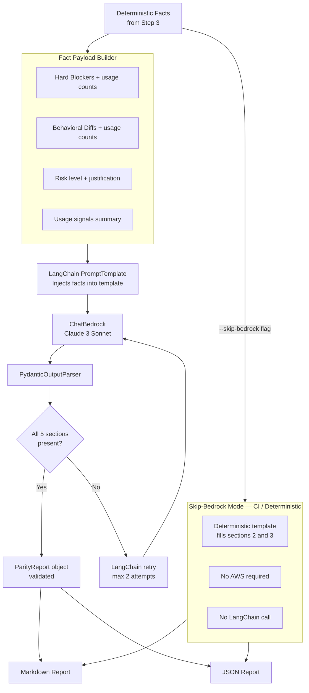
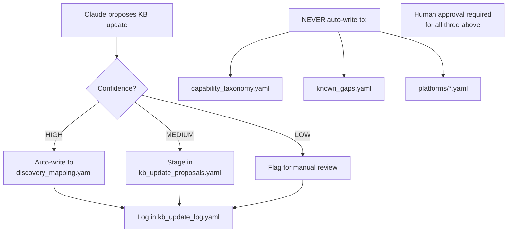

# PACE SCM Migration — Platform Parity Module
## Discovery-Enriched Parity Engine: Implementation Plan

**Version:** 2.0
**Date:** 2026-08-12
**Status:** Pre-Implementation Planning
**Scope:** Platform Parity Module — Self-Evolving Discovery-Enriched Architecture
**Author:** Platform Migration Engineering Team

---

## 1. Problem Statement

The current platform parity system compares two SCM platforms using a static Knowledge Base and produces reports like:

> *"Service Desk: HARD\_BLOCKER — GitLab supports it, GitHub does not."*

This is technically correct but **operationally useless** for a migration team. It does not answer the questions that actually drive migration planning:

| Unanswered Question | Why It Matters |
|---|---|
| How many repositories actually use this feature? | 1 repo vs 219 repos requires completely different remediation budgets |
| Which blockers demand immediate action? | Teams cannot plan sprints without urgency ordering |
| Where did that count come from? | Auditors and approvers need traceable evidence |
| What happens when a new discovery CSV arrives with unknown columns? | Static systems silently miss new signals |

**This implementation plan describes a system that answers all four questions** by combining a
deterministic evidence engine, a self-evolving Knowledge Base, and a LangChain-orchestrated
LLM narrator.

The system will transform reports from:
Service Desk → HARD_BLOCKER

Into:
Service Desk → HARD_BLOCKER
219 of 243 repositories affected (90.1%)
Urgency: HIGH
Evidence: service_desk_enabled = true (243 rows scanned)
This will break immediately post-migration.
Plan replacement before go-live.

---

## 2. Core Architectural Principle

Before any diagram or code, one rule governs every design decision in this system:


```text
┌─────────────────────────────────────────────────────────────────┐
│                                                                 │
│ DETERMINISTIC ENGINE → DECIDES all migration facts              │
│ KB UPDATER → EXPANDS knowledge over time                        │
│ CLAUDE via LANGCHAIN → EXPLAINS facts as narrative              │
│                                                                 │
│ Claude never creates a blocker.                                 │
│ Claude never removes a blocker.                                 │
│ Claude never changes a risk level.                              │
│ Claude never writes directly to any KB file.                    │
│ Every number in the report traces back to a CSV column.         │
│                                                                 │
└─────────────────────────────────────────────────────────────────┘
```

This separation is non-negotiable. It is what makes the system auditable, reproducible,
and safe for enterprise migration decisions.

---

## 3. Three-Layer Architecture

```text
┌─────────────────────────────────────────────────────────────────────┐
│ PARITY CHECK SYSTEM v2.0                                            │
├─────────────────────────────────────────────────────────────────────┤
│                                                                     │
│ Layer 1 — EVIDENCE (Discovery CSV + Knowledge Base)                 │
│ ────────────────────────────────────────────────                    │
│ Real repository usage data extracted from discovery CSV.            │
│ Curated, versioned, human-reviewable capability declarations.       │
│ No inference. No hallucination. Ground truth only.                  │
│                                                                     │
│ Layer 2 — LOGIC (Deterministic Comparison Engine)                   │
│ ─────────────────────────────────────────────────                   │
│ Structural diff of KB data enriched with usage signals.             │
│ Same inputs always produce identical gap analysis.                  │
│ Auditable, unit-testable. No LLM involved at this layer.            │
│                                                                     │
│ Layer 3 — NARRATIVE (LangChain + AWS Bedrock Claude)                │
│ ────────────────────────────────────────────────────                │
│ LLM receives pre-computed structured facts and generates            │
│ human-readable narrative. LLM explains facts. Never decides them.   │
│ LangChain enforces structured output via PydanticOutputParser.      │
│                                                                     │
└─────────────────────────────────────────────────────────────────────┘
```
---

## 4. Full System Architecture

### 4.1 High-Level Data Flow



### 4.2 KB Self-Evolution Flow



### 4.3 Usage Signal Evidence Chain



### 4.4 Report Generation — LangChain Pipeline




### 4.5 KB Write Safety Model



## 5. Knowledge Base Design

### 5.1 File Structure

```text
capability_kb/
├── capability_taxonomy.yaml      ← 54 canonical capability IDs — source of truth
├── known_gaps.yaml               ← Curated per-path migration gap records
├── discovery_mapping.yaml        ← NEW: CSV column → capability mapping config
├── kb_update_proposals.yaml      ← NEW: Human review staging area
├── kb_update_log.yaml            ← NEW: Full audit log of every auto-update
└── platforms/
    ├── gitlab.yaml               ← Per-capability support data
    ├── github.yaml               ← Per-capability support data
    ├── azure_devops.yaml         ← Per-capability support data
    └── bitbucket.yaml            ← Per-capability support data
```

### 5.2 New File: discovery\_mapping.yaml

This is the master translation table between discovery CSV columns and capability IDs.
It is **configuration — not code**. Adding support for a new platform's CSV columns
requires only a YAML change, not a code change.

```yaml
# discovery_mapping.yaml
# Maps CSV columns from any SCM discovery report to canonical capability IDs.
# This file grows automatically as new discovery CSVs are processed.

repo.lfs:
  columns:
    - lfs_enabled
    - total_lfs_files
    - lfs_objects_size_bytes
  detection_rule: any_positive
  confidence: HIGH
  value_type: numeric
  platforms: [gitlab]
  last_updated: "2026-08-12"

review.draft_pr:
  columns:
    - mr_draft_count           # GitLab column name
    - draft_pull_requests      # GitHub column name (added later)
  detection_rule: any_positive
  confidence: HIGH
  value_type: numeric
  platforms: [gitlab, github]
  last_updated: "2026-08-12"

review.approval_rules:
  columns:
    - total_approval_rules
    - approval_rules_names
    - approval_rules_min_approvals
  detection_rule: any_positive
  confidence: HIGH
  value_type: numeric
  platforms: [gitlab]
  last_updated: "2026-08-12"
```

### 5.3 Usage Signal Schema

Every capability in the pipeline output carries this structure after Step 0 runs:
```json
{
  "review.draft_pr": {
    "repo_count": 131,
    "percentage": 53.9,
    "urgency": "HIGH",
    "confidence": "HIGH",
    "total_value": 847,
    "examples": ["repo-alpha", "repo-beta", "repo-gamma"],
    "evidence": {
      "columns": ["mr_draft_count"],
      "detection_rule": "value > 0",
      "value_type": "numeric"
    }
  }
}
```
The `evidence` block is the audit trail. Every number in the final report is traceable back to a specific column and detection rule.

### 5.4 KB Write Safety Rules

| **File** | **Auto-write Allowed** | **Condition** |
| --- | --- | --- |
| **`discovery_mapping.yaml`** | ✅ Yes | Confidence HIGH only |
| **`kb_update_log.yaml`** | ✅ Yes | Always — audit trail |
| **`kb_update_proposals.yaml`** | ✅ Yes | Staging only — not live KB |
| **`capability_taxonomy.yaml`** | ❌ Never | Human approval required |
| **`known_gaps.yaml`** | ❌ Never | Human approval required |
| **`platforms/*.yaml`** | ❌ Never | Human approval required |

---

## 6. Component Specifications

### 6.1 Step 0 — platform\_parity\_parse\_discovery.py
