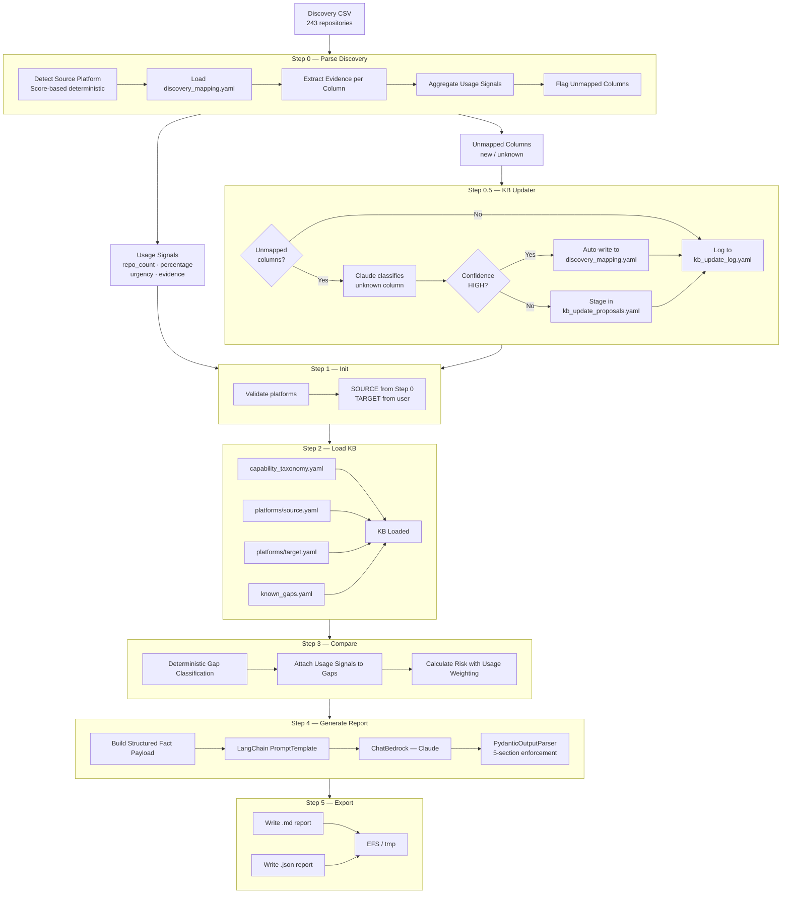
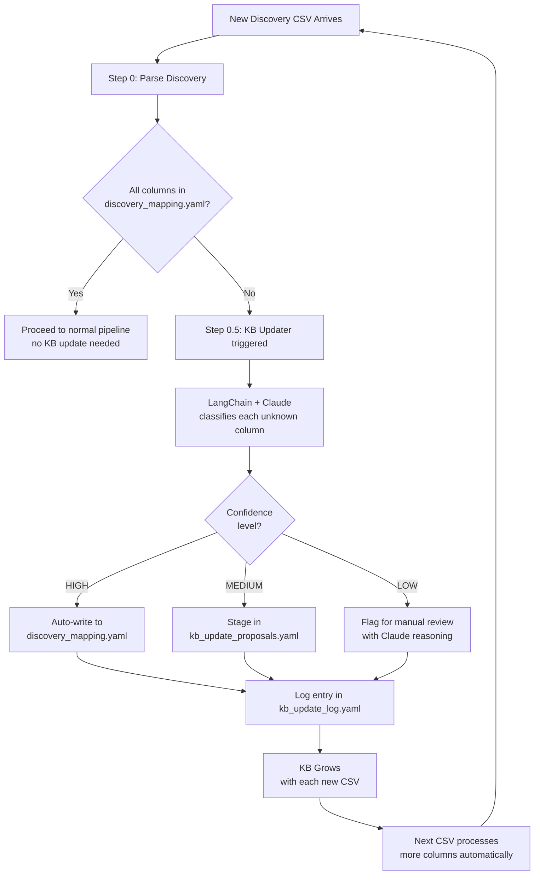
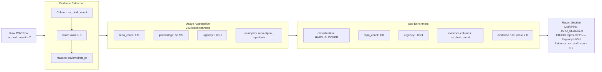
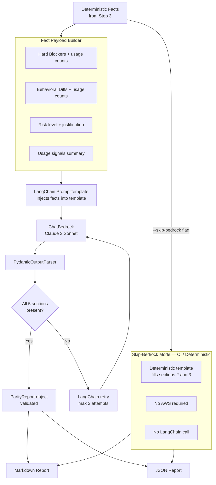
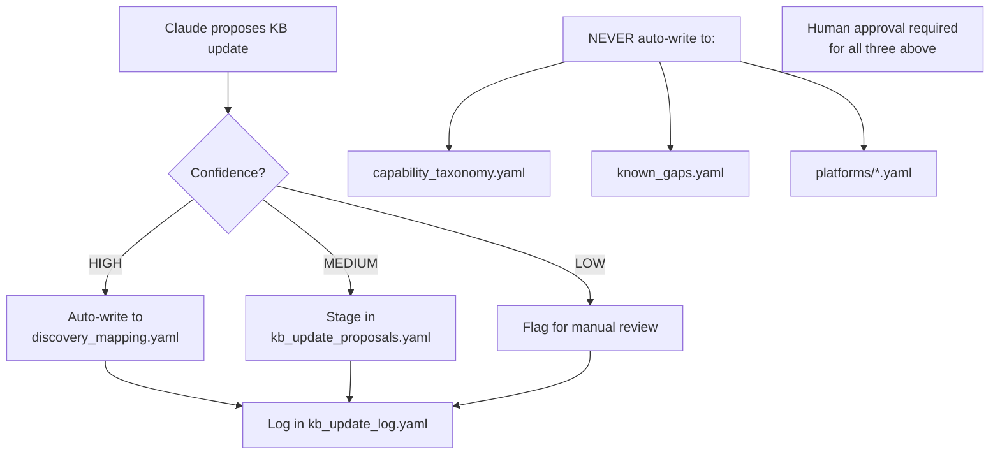

# PACE SCM Migration — Platform Parity Module
## Discovery-Enriched Parity Engine: Implementation Plan

**Version:** 2.0
**Date:** 2026-08-12
**Status:** Pre-Implementation Planning
**Scope:** Platform Parity Module — Self-Evolving Discovery-Enriched Architecture
**Author:** Platform Migration Engineering Team

---

## 1. Problem Statement

The current platform parity system compares two SCM platforms using a static Knowledge Base and produces reports like:

> *"Service Desk: HARD\_BLOCKER — GitLab supports it, GitHub does not."*

This is technically correct but **operationally useless** for a migration team. It does not answer the questions that actually drive migration planning:

| Unanswered Question | Why It Matters |
|---|---|
| How many repositories actually use this feature? | 1 repo vs 219 repos requires completely different remediation budgets |
| Which blockers demand immediate action? | Teams cannot plan sprints without urgency ordering |
| Where did that count come from? | Auditors and approvers need traceable evidence |
| What happens when a new discovery CSV arrives with unknown columns? | Static systems silently miss new signals |

**This implementation plan describes a system that answers all four questions** by combining a
deterministic evidence engine, a self-evolving Knowledge Base, and a LangChain-orchestrated
LLM narrator.

The system will transform reports from:
Service Desk → HARD_BLOCKER

Into:
Service Desk → HARD_BLOCKER
219 of 243 repositories affected (90.1%)
Urgency: HIGH
Evidence: service_desk_enabled = true (243 rows scanned)
This will break immediately post-migration.
Plan replacement before go-live.

---

## 2. Core Architectural Principle

Before any diagram or code, one rule governs every design decision in this system:


```text
┌─────────────────────────────────────────────────────────────────┐
│                                                                 │
│ DETERMINISTIC ENGINE → DECIDES all migration facts              │
│ KB UPDATER → EXPANDS knowledge over time                        │
│ CLAUDE via LANGCHAIN → EXPLAINS facts as narrative              │
│                                                                 │
│ Claude never creates a blocker.                                 │
│ Claude never removes a blocker.                                 │
│ Claude never changes a risk level.                              │
│ Claude never writes directly to any KB file.                    │
│ Every number in the report traces back to a CSV column.         │
│                                                                 │
└─────────────────────────────────────────────────────────────────┘
```

This separation is non-negotiable. It is what makes the system auditable, reproducible,
and safe for enterprise migration decisions.

---

## 3. Three-Layer Architecture

```text
┌─────────────────────────────────────────────────────────────────────┐
│ PARITY CHECK SYSTEM v2.0                                            │
├─────────────────────────────────────────────────────────────────────┤
│                                                                     │
│ Layer 1 — EVIDENCE (Discovery CSV + Knowledge Base)                 │
│ ────────────────────────────────────────────────                    │
│ Real repository usage data extracted from discovery CSV.            │
│ Curated, versioned, human-reviewable capability declarations.       │
│ No inference. No hallucination. Ground truth only.                  │
│                                                                     │
│ Layer 2 — LOGIC (Deterministic Comparison Engine)                   │
│ ─────────────────────────────────────────────────                   │
│ Structural diff of KB data enriched with usage signals.             │
│ Same inputs always produce identical gap analysis.                  │
│ Auditable, unit-testable. No LLM involved at this layer.            │
│                                                                     │
│ Layer 3 — NARRATIVE (LangChain + AWS Bedrock Claude)                │
│ ────────────────────────────────────────────────────                │
│ LLM receives pre-computed structured facts and generates            │
│ human-readable narrative. LLM explains facts. Never decides them.   │
│ LangChain enforces structured output via PydanticOutputParser.      │
│                                                                     │
└─────────────────────────────────────────────────────────────────────┘
```
---

## 4. Full System Architecture

### 4.1 High-Level Data Flow



### 4.2 KB Self-Evolution Flow



### 4.3 Usage Signal Evidence Chain



### 4.4 Report Generation — LangChain Pipeline




### 4.5 KB Write Safety Model



## 5. Knowledge Base Design

### 5.1 File Structure

```text
capability_kb/
├── capability_taxonomy.yaml      ← 54 canonical capability IDs — source of truth
├── known_gaps.yaml               ← Curated per-path migration gap records
├── discovery_mapping.yaml        ← NEW: CSV column → capability mapping config
├── kb_update_proposals.yaml      ← NEW: Human review staging area
├── kb_update_log.yaml            ← NEW: Full audit log of every auto-update
└── platforms/
    ├── gitlab.yaml               ← Per-capability support data
    ├── github.yaml               ← Per-capability support data
    ├── azure_devops.yaml         ← Per-capability support data
    └── bitbucket.yaml            ← Per-capability support data
```

### 5.2 New File: discovery\_mapping.yaml

This is the master translation table between discovery CSV columns and capability IDs.
It is **configuration — not code**. Adding support for a new platform's CSV columns
requires only a YAML change, not a code change.

```yaml
# discovery_mapping.yaml
# Maps CSV columns from any SCM discovery report to canonical capability IDs.
# This file grows automatically as new discovery CSVs are processed.

repo.lfs:
  columns:
    - lfs_enabled
    - total_lfs_files
    - lfs_objects_size_bytes
  detection_rule: any_positive
  confidence: HIGH
  value_type: numeric
  platforms: [gitlab]
  last_updated: "2026-08-12"

review.draft_pr:
  columns:
    - mr_draft_count           # GitLab column name
    - draft_pull_requests      # GitHub column name (added later)
  detection_rule: any_positive
  confidence: HIGH
  value_type: numeric
  platforms: [gitlab, github]
  last_updated: "2026-08-12"

review.approval_rules:
  columns:
    - total_approval_rules
    - approval_rules_names
    - approval_rules_min_approvals
  detection_rule: any_positive
  confidence: HIGH
  value_type: numeric
  platforms: [gitlab]
  last_updated: "2026-08-12"
```

### 5.3 Usage Signal Schema

Every capability in the pipeline output carries this structure after Step 0 runs:
```json
{
  "review.draft_pr": {
    "repo_count": 131,
    "percentage": 53.9,
    "urgency": "HIGH",
    "confidence": "HIGH",
    "total_value": 847,
    "examples": ["repo-alpha", "repo-beta", "repo-gamma"],
    "evidence": {
      "columns": ["mr_draft_count"],
      "detection_rule": "value > 0",
      "value_type": "numeric"
    }
  }
}
```
The `evidence` block is the audit trail. Every number in the final report is traceable back to a specific column and detection rule.

### 5.4 KB Write Safety Rules

| **File** | **Auto-write Allowed** | **Condition** |
| --- | --- | --- |
| **`discovery_mapping.yaml`** | ✅ Yes | Confidence HIGH only |
| **`kb_update_log.yaml`** | ✅ Yes | Always — audit trail |
| **`kb_update_proposals.yaml`** | ✅ Yes | Staging only — not live KB |
| **`capability_taxonomy.yaml`** | ❌ Never | Human approval required |
| **`known_gaps.yaml`** | ❌ Never | Human approval required |
| **`platforms/*.yaml`** | ❌ Never | Human approval required |

---

## 6. Component Specifications

### 6.1 Step 0 — platform\_parity\_parse\_discovery.py

| **Property** | **Detail** |
| --- | --- |
| Type | New script |
| LLM involved | No |
| LangChain involved | No |
| Dependencies | **`csv`**, **`json`**, **`yaml`**, **`pathlib`**, **`sys`**, **`re`** — stdlib only |
| Input placeholders | **`CSV_PATH`**, **`EXECUTION_ID`** |

Platform detection uses a score-based model — not string matching alone:
```text
GitLab URL found in http_url / ssh_url     → +100 points
GitLab-specific column found               → +20 points each
GitHub-specific column found               → -20 points each
Azure DevOps-specific column found         → -20 points each

Score ≥ 100  → HIGH confidence
Score 60–99  → MEDIUM confidence
Score < 60   → RuntimeError (ambiguous — do not guess)
```

Urgency thresholds:
```text
repo_percentage > 50%  →  HIGH
repo_percentage > 10%  →  MEDIUM
repo_percentage ≤ 10%  →  LOW
```

Output keys:

| **Key** | **Type** | **Description** |
| --- | --- | --- |
| **`source_platform`** | string | Detected platform: **`gitlab`** / **`github`** / **`azure_devops`** / **`bitbucket`** |
| **`platform_confidence`** | string | **`HIGH`** / **`MEDIUM`** / **`LOW`** |
| **`platform_evidence`** | object | **`url_matches`** count, platform-specific columns found |
| **`total_repos`** | int | Row count from CSV |
| **`usage_signals`** | object | capability_id → enriched signal object |
| **`unmapped_columns`** | list | Column names not found in **`discovery_mapping.yaml`** |
| **`column_stats`** | object | Raw per-column aggregate stats |
| **`csv_columns`** | list | All column names found in the CSV |


### 6.2 Step 0.5 — platform\_parity\_kb\_updater.py
| **Property** | **Detail** |
| --- | --- |
| Type | New script |
| LLM involved | Yes — column classification only |
| LangChain involved | Yes — PromptTemplate + ChatBedrock + PydanticOutputParser |
| Triggers | Only when **`unmapped_columns`** is non-empty |
| Input placeholders | **`KB_BASE_PATH`**, **`AUTO_UPDATE_THRESHOLD`**, **`EXECUTION_ID`** |

LangChain components used:
```python
from langchain_aws import ChatBedrock
from langchain.prompts import PromptTemplate
from langchain_core.output_parsers import PydanticOutputParser

class KBUpdateProposal(BaseModel):
    column_name: str
    maps_to_capability: str      # existing ID or "NEW"
    proposed_capability_id: str  # only if maps_to == "NEW"
    detection_rule: str          # e.g. "value > 0" / "boolean_true"
    confidence: str              # HIGH / MEDIUM / LOW
    reasoning: str               # Claude's explanation for audit log
```

**What Claude is asked here — and nothing more:**

```text
Given:
  - Unknown CSV column name: "workflow_runs"
  - Sample values from 10 repos: [0, 0, 5, 12, 0, 3, 0, 8, 0, 1]
  - Source platform detected: github
  - Full capability taxonomy: [54 capability IDs provided]

Answer:
  1. Which existing capability does this column most likely measure?
  2. What is the correct detection rule?
  3. How confident are you? (HIGH / MEDIUM / LOW)
  4. If no existing capability fits, propose a new capability ID.
  5. Explain your reasoning in one sentence.
```

Write behaviour by confidence level:
| **Confidence** | **Action** |
| --- | --- |
| HIGH | Auto-write to **`discovery_mapping.yaml`** + log to **`kb_update_log.yaml`** |
| MEDIUM | Write to **`kb_update_proposals.yaml`** only + log |
| LOW | Write to **`kb_update_proposals.yaml`** only + log |
| Any | Always log to **`kb_update_log.yaml`** |


### 6.3 Step 3 — platform_parity_compare.py (Enhanced)

The gap classification logic is completely unchanged. Usage signals are attached
after classification.

Gap object before enhancement:
```json
{
  "capability_id": "service_desk",
  "classification": "HARD_BLOCKER"
}
```

Gap object after enhancement:
```json
{
  "capability_id": "service_desk",
  "classification": "HARD_BLOCKER",
  "repo_count": 219,
  "repo_percentage": 90.1,
  "urgency": "HIGH",
  "confidence": "HIGH",
  "examples": ["repo-1", "repo-2", "repo-3"],
  "evidence": {
    "columns": ["service_desk_enabled"],
    "detection_rule": "boolean_true",
    "value_type": "boolean"
  }
}
```

Usage-aware risk weighting:
| **Condition** | **Risk Level** |
| --- | --- |
| Hard blocker + usage ≥ 50% | CRITICAL |
| Hard blocker + usage 10–49% | HIGH |
| Hard blocker + usage < 10% | HIGH (serious, lower priority) |
| Behavioral diff + usage ≥ 50% | HIGH |
| Behavioral diff + usage < 50% | MEDIUM |
| Partial support only | MEDIUM |
| All seamless | LOW |


### 6.4 Step 4 — platform\_parity\_generate_report.py (LangChain)

LangChain chain structure:

```python
from langchain_aws import ChatBedrock
from langchain.prompts import PromptTemplate
from langchain_core.output_parsers import PydanticOutputParser
from langchain_core.runnables import RunnableSequence

chain = PromptTemplate(...) | ChatBedrock(...) | PydanticOutputParser(...)
```

System instruction injected into every prompt:
```text
The supplied facts are authoritative.
Do not invent capabilities.
Do not alter classifications.
Do not introduce workarounds not present in the input.
Do not change risk levels.
Your responsibility is explanation only.
Reference repository counts and urgency in every section you write.
```

Pydantic model enforcing 5-section structure:
```python
class ParityReport(BaseModel):
    executive_summary: str
    hard_blockers_section: str
    behavioral_differences_section: str
    seamless_section: str
    coverage_section: str
```

If Claude omits any section, the PydanticOutputParser raises and LangChain retries automatically up to the configured maximum attempts.

Skip-bedrock mode is fully preserved. When --skip-bedrock is set, the LangChain call is bypassed entirely and deterministic templates fill the report sections.
No AWS credentials required.

---

## 7. Complete File Change Register

New Files

| **File** | **Purpose** |
| --- | --- |
| **`capability_kb/discovery_mapping.yaml`** | CSV column → capability mapping config |
| **`capability_kb/kb_update_proposals.yaml`** | Human review staging area for MEDIUM/LOW proposals |
| **`capability_kb/kb_update_log.yaml`** | Full audit log of every auto-update |
| **`scripts/platform_parity_parse_discovery.py`** | Step 0 — CSV parser and usage aggregator |
| **`scripts/platform_parity_kb_updater.py`** | Step 0.5 — KB self-evolution engine |
| **`metadata/platform_parity_parse_discovery.txt`** | Script descriptor |
| **`metadata/platform_parity_kb_updater.txt`** | Script descriptor |
| **`platform_parity_run.py`** | CLI entry point for local runs |

### Modified Files

| **File** | **Change** |
| --- | --- |
| **`scripts/platform_parity_init.py`** | **`SOURCE_PLATFORM`** now reads from Step 0 — no longer a user input |
| **`scripts/platform_parity_compare.py`** | Attaches usage signals to gap objects; usage-aware risk weighting |
| **`scripts/platform_parity_generate_report.py`** | Raw boto3 replaced with LangChain PromptTemplate + ChatBedrock + PydanticOutputParser |
| **`workflow/platform_parity_workflow.json`** | Steps 0 and 0.5 added before existing steps |
| **`test_bedrock_e2e.py`** | Optional **`--csv`** argument; wires to parse_discovery before pipeline |

### Unchanged Files

| **File** | **Reason Unchanged** |
| --- | --- |
| **`scripts/platform_parity_load_kb.py`** | Loads updated KB — no logic change needed |
| **`scripts/platform_parity_export.py`** | Fully compatible with enriched gap objects |
| **`capability_kb/capability_taxonomy.yaml`** | Grows only via human approval |
| **`capability_kb/known_gaps.yaml`** | Grows only via human approval |
| **`capability_kb/platforms/*.yaml`** | Updated only via human approval |

---

## 8. Updated Workflow Definition

```json
{
  "name": "platform_parity_check",
  "steps": [
    {
      "name": "platform_parity_parse_discovery",
      "values": {
        "CSV_PATH": ""
      }
    },
    {
      "name": "platform_parity_kb_updater",
      "values": {
        "KB_BASE_PATH": "",
        "AUTO_UPDATE_THRESHOLD": "HIGH"
      }
    },
    {
      "name": "platform_parity_init",
      "values": {
        "TARGET_PLATFORM": "",
        "OUTPUT_FORMAT": "markdown",
        "SCOPE_FILTER": "[]",
        "AWS_REGION": "",
        "BEDROCK_MODEL_ID": "anthropic.claude-3-sonnet-20240229-v1:0",
        "KB_BASE_PATH": "",
        "NO_CACHE": false,
        "PROJECT_ID": ""
      }
    },
    { "name": "platform_parity_load_kb" },
    { "name": "platform_parity_compare" },
    {
      "name": "platform_parity_generate_report",
      "activity_options": {
        "start_to_close_seconds": 120,
        "heartbeat_seconds": 30,
        "retry_policy": {
          "maximum_attempts": 2,
          "non_retryable_error_types": ["ScriptNotFoundError"]
        }
      }
    },
    { "name": "platform_parity_export" }
  ]
}
```

> ***Key change: `SOURCE_PLATFORM` is removed from `platform_parity_init` values.***
> ***It now flows automatically from `{{steps.platform_parity_parse_discovery.source_platform}}`.***

---

## 9. Implementation Phases

### Phase 1 — Discovery Mapping Configuration

**Duration:** 1–2 days
**Goal:** Move all CSV column → capability mapping out of code and into versioned config.
**LLM involved:** No
**Dependencies:** None

| **Deliverable** | **Description** |
| --- | --- |
| **`capability_kb/discovery_mapping.yaml`** | Complete mapping for all 30+ GitLab discovery CSV columns |

**Acceptance criteria:**

- Every column from the discovery CSV column mapping is represented
- Each entry includes: **`columns`**, **`detection_rule`**, **`confidence`**, **`value_type`**, **`platforms`**, **`last_updated`**
- File is valid YAML and loads without error

---

### Phase 2 — Step 0: Parse Discovery

**Duration:** 2–3 days
**Goal:** Build the CSV parser — the foundation all other phases depend on.
**LLM involved:** No
**Dependencies:** Phase 1

| **Deliverable** | **Description** |
| --- | --- |
| **`scripts/platform_parity_parse_discovery.py`** | Complete Step 0 script |
| **`metadata/platform_parity_parse_discovery.txt`** | Script descriptor |

**Acceptance criteria:**

- Correctly detects GitLab from the real discovery CSV using score-based detection
- Produces **`usage_signals`** for all mapped columns
- Produces **`unmapped_columns`** list for any column not in **`discovery_mapping.yaml`**
- All output is valid JSON-serializable
- Raises **`RuntimeError`** (not **`sys.exit`**) on platform detection failure
- Follows all script writing rules from the repository guide
- Passes with **`--skip-bedrock`** mode in test runner

---

### Phase 3 — Step 0.5: KB Updater

**Duration:** 2–3 days
**Goal:** Build the self-evolution engine that grows the KB as new CSVs arrive.
**LLM involved:** Yes (column classification only)
**Dependencies:** Phase 2

| **Deliverable** | **Description** |
| --- | --- |
| **`scripts/platform_parity_kb_updater.py`** | Step 0.5 script |
| **`metadata/platform_parity_kb_updater.txt`** | Script descriptor |
| **`capability_kb/kb_update_proposals.yaml`** | Initial empty file with schema comment |
| **`capability_kb/kb_update_log.yaml`** | Initial empty file with schema comment |

**Acceptance criteria:**

- No-ops silently when **`unmapped_columns`** is empty
- Calls LangChain + ChatBedrock only for non-empty **`unmapped_columns`**
- HIGH confidence proposals auto-write to **`discovery_mapping.yaml`**
- MEDIUM/LOW confidence proposals write to **`kb_update_proposals.yaml`** only
- All proposals (any confidence) logged to **`kb_update_log.yaml`**
- Never writes to **`capability_taxonomy.yaml`**, **`known_gaps.yaml`**, or **`platforms/*.yaml`**
- Uses **`PydanticOutputParser`** to enforce structured Claude output
- Follows all script writing rules

---

### Phase 4 — Modify Init Script

**Duration:** 0.5 days
**Goal:** Remove **`SOURCE_PLATFORM`** as a user input — it now comes from Step 0 automatically.
**LLM involved:** No
**Dependencies:** Phase 2

**Change:**

```python
# Before
source_platform = {{SOURCE_PLATFORM}}

# After
source_platform = {{steps.platform_parity_parse_discovery.source_platform}}
```

**Acceptance criteria:**

- **`SOURCE_PLATFORM`** removed from workflow JSON values block
- Script reads source platform from Step 0 output
- All downstream **`{{steps.platform_parity_init.*}}`** references continue to work unchanged

---

### Phase 5 — Enhance Compare Script

**Duration:** 1–2 days
**Goal:** Attach usage signals to every gap object and apply usage-aware risk weighting.
**LLM involved:** No
**Dependencies:** Phase 2

**Acceptance criteria:**

- Every gap object in output includes: **`repo_count`**, **`repo_percentage`**, **`urgency`**, **`confidence`**, **`examples`**, **`evidence`**
- Gap objects with no usage signal carry **`repo_count: 0`**, **`urgency: "LOW"`**
- Risk calculation uses the usage-aware weighting table from Section 6.3
- Deterministic gap classification logic is completely unchanged

---

### Phase 6 — Enhance Generate Report with LangChain

**Duration:** 2–3 days
**Goal:** Replace raw boto3 call with LangChain chain for structured, reliable report generation.
**LLM involved:** Yes
**Dependencies:** Phase 5

**LangChain components:**

| **Component** | **Import** | **Purpose** |
| --- | --- | --- |
| **`ChatBedrock`** | **`langchain_aws`** | Claude access via Bedrock |
| **`PromptTemplate`** | **`langchain.prompts`** | Structured prompt construction |
| **`PydanticOutputParser`** | **`langchain_core.output_parsers`** | Enforce 5-section output |
| **`RunnableSequence`** | **`langchain_core.runnables`** | Chain composition |

**Acceptance criteria:**

- All 5 report sections present in every output
- If Claude omits a section, LangChain retries up to **`maximum_attempts`**
- SHA-256 cache logic preserved (7-day TTL)
- **`--skip-bedrock`** mode bypasses LangChain call entirely — no AWS credentials needed
- System instruction forbidding invented facts present in every prompt call
- Every report section references repo counts and urgency where available

---

### Phase 7 — CLI Entry Point

**Duration:** 1 day
**Goal:** Provide a user-friendly local run interface that wraps the pipeline.
**LLM involved:** No
**Dependencies:** Phase 2

**Expected interaction:**

```text
$ python platform_parity_run.py --csv discovery_report.csv

Detecting source platform...

  Platform   : GitLab
  Confidence : HIGH
  Evidence   : 243 gitlab.com URLs · 5 GitLab-specific columns

Enter target platform (github / azure_devops / bitbucket): github

Starting parity analysis for GitLab → GitHub (243 repositories)...
Report written to: test_output/gitlab_to_github_a3f9c1.md
```

**Acceptance criteria:**

- Accepts **`--csv`** path argument
- Displays detection result with confidence and evidence before prompting for target
- Prompts for target platform if not supplied via **`--target`** argument
- Temporal workflow itself remains non-interactive

---

### Phase 8 — Workflow and Test Runner Update

**Duration:** 1 day
**Goal:** Wire everything together in the Temporal workflow definition and update the test runner.
**Dependencies:** All previous phases

| **Deliverable** | **Change** |
| --- | --- |
| **`workflow/platform_parity_workflow.json`** | Add Steps 0 and 0.5 |
| **`test_bedrock_e2e.py`** | Add **`--csv`** optional argument; wire to parse_discovery before pipeline |

**Acceptance criteria:**

- **`--skip-bedrock`** test mode runs Steps 0, 1, 2, 3, 5 fully; skips Steps 0.5 and 4
- Matrix runner **`run_parity_matrix.py`** continues to work without CSV input
- New **`--csv`** argument in test runner is optional — existing behaviour unchanged when omitted

---

## 10. Technology Stack

| **Component** | **Technology** | **Rationale** |
| --- | --- | --- |
| Orchestration | Temporal Workflow | Existing — not changed |
| CSV Parsing | Python **`csv.DictReader`** | Stdlib only — no pandas needed for flat row iteration |
| Platform Detection | Python deterministic scoring | Auditable, reproducible, no LLM inference |
| KB Format | YAML | Human-readable, diff-friendly, PR-reviewable |
| LLM Access | AWS Bedrock Claude 3 Sonnet | Enterprise-grade, no data egress beyond AWS boundary |
| LLM Orchestration | LangChain (**`langchain-aws`**) | Structured prompting, output parsing, retry, future RAG path |
| Output Enforcement | Pydantic **`BaseModel`** | 5-section structure validated on every response |
| Caching | SHA-256 file cache | Deterministic, no external dependency |
| Output Formats | Markdown + JSON | Markdown for stakeholders; JSON for pipeline integration |

New Python Dependencies
```text
langchain>=0.2
langchain-aws
langchain-community
langchain-core
```

***No FAISS. No Chroma. No vector store at this stage.***
***The KB is 54 capabilities — retrieval adds complexity with no benefit at this scale.***
***When the KB grows beyond \~200 capabilities, AWS Bedrock Knowledge Bases is the***
***recommended RAG path — not a self-managed vector store.***

---

## 11. Risks and Mitigations

| **Risk** | **Likelihood** | **Impact** | **Mitigation** |
| --- | --- | --- | --- |
| KB Updater auto-writes incorrect mapping | Low | High | HIGH confidence threshold only; every write logged; MEDIUM/LOW staged for human review |
| Claude invents a gap not in KB | Medium | High | System instruction in every prompt explicitly forbids this; Pydantic parser rejects invalid output |
| New CSV schema breaks parser | Medium | Medium | Unmapped columns flagged explicitly — never silently dropped; Step 0.5 classifies them |
| LangChain retry budget exhausted | Low | Medium | Deterministic fallback template fills sections 2 and 3 regardless of LLM response |
| Discovery CSV has no URL column | Low | Medium | Column fingerprint fallback in platform detection; RuntimeError if confidence below threshold |
| Bedrock outage | Low | Medium | Report generation is the last step; structured JSON from compare step is always available |

---

## 12. Success Metrics

| **Metric** | **Target** |
| --- | --- |
| Repo impact coverage | Every HARD_BLOCKER and BEHAVIORAL_DIFF carries a repo count and percentage |
| Evidence traceability | Every number in every report traces to a specific CSV column and detection rule |
| KB auto-update precision | Zero incorrect HIGH-confidence auto-writes (validated by audit of first 10 runs) |
| False negative rate | Zero missed blockers for capabilities in KB with HIGH confidence |
| Skip-bedrock CI mode | Passes in under 10 seconds with no AWS credentials |
| Report generation time | Under 30 seconds end-to-end including LLM call |
| LLM token cost per report | Under $0.10 per run |

---

## 13. Future Evolution Path

```mermaid
flowchart LR
    subgraph P1["Phase 1 — Now"]
        A1[YAML KB\n54 capabilities]
        A2[CSV Evidence]
        A3[Deterministic Engine]
        A4[Bedrock Narrator\nvia LangChain]
    end

    subgraph P2["Phase 2 — KB Growth"]
        B1[Structured KB\n200+ capabilities]
        B2[Bedrock Knowledge Base\nManaged RAG]
        B3[Deterministic Engine\nunchanged]
        B4[Bedrock Narrator\nunchanged]
    end

    subgraph P3["Phase 3 — Migration Intelligence"]
        C1[Discovery Data\nany SCM platform]
        C2[Knowledge Retrieval\nBedrock KB]
        C3[Deterministic Facts Engine]
        C4[LLM Narrator\nunchanged]
    end

    P1 -->|"KB grows beyond ~200 capabilities"| P2
    P2 -->|Multi-platform discovery CSVs| P3
```



**When to introduce RAG:** When the KB grows beyond approximately 200 capabilities across 6+ platforms, semantic retrieval becomes more efficient than loading all KB
content into every prompt. At that point, AWS Bedrock Knowledge Bases (managed RAG) is the recommended path — not FAISS or Chroma — because it preserves the enterprise
security boundary and removes the infrastructure burden of managing a vector store.

--- 

# 14. Appendix — Before and After

### Report Quality Comparison

| **Dimension** | **Current System** | **After This Plan** |
| --- | --- | --- |
| Gap classification | ✅ Correct | ✅ Correct (unchanged) |
| Repository impact | ❌ Not shown | ✅ Count + percentage + urgency |
| Evidence traceability | ❌ None | ✅ Full CSV column → evidence → count chain |
| KB evolution | ❌ Manual only | ✅ Auto-grows from new CSVs with safety gating |
| New CSV columns | ❌ Silently ignored | ✅ Flagged, classified, optionally auto-mapped |
| Report structure enforcement | ⚠️ Post-hoc validation | ✅ PydanticOutputParser prevents malformed output |
| Platform detection | ❌ Manual user input | ✅ Auto-detected from CSV with confidence scoring |

### Architecture State Comparison

| **Dimension** | **Current** | **Target** |
| --- | --- | --- |
| Steps in pipeline | 5 | 7 (Steps 0 and 0.5 added) |
| LLM touchpoints | 1 (generate_report) | 2 (kb_updater + generate_report) |
| LangChain | Not used | generate_report + kb_updater |
| KB files | 6 | 9 (+discovery_mapping, +proposals, +log) |
| New Python dependencies | — | langchain, langchain-aws, langchain-community, langchain-core |
| CSV awareness | None | Full evidence extraction and usage aggregation |
| Skip-bedrock support | ✅ Preserved | ✅ Preserved |

---

*End of Implementation Plan — Platform Parity Module v2.0*
