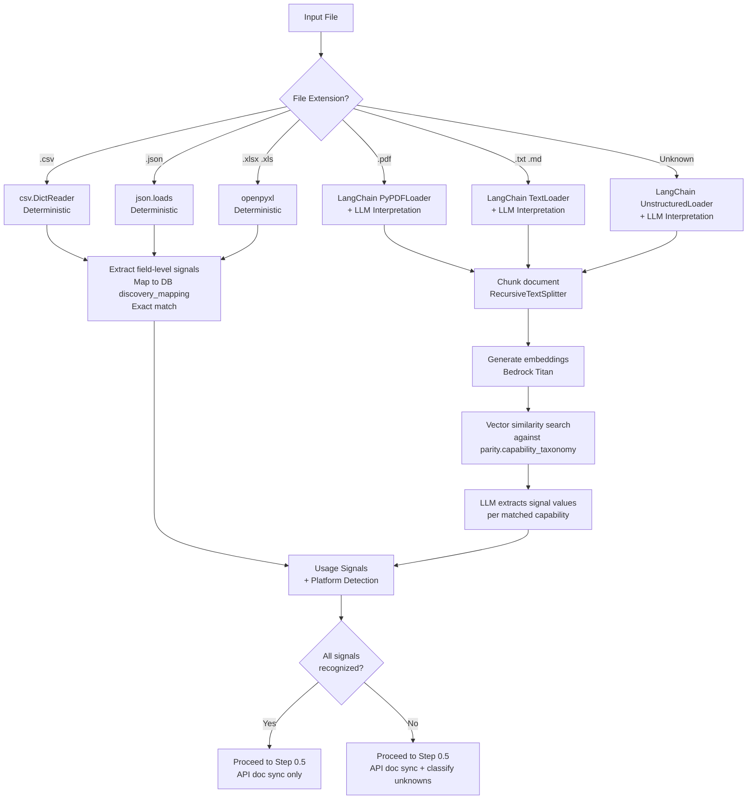
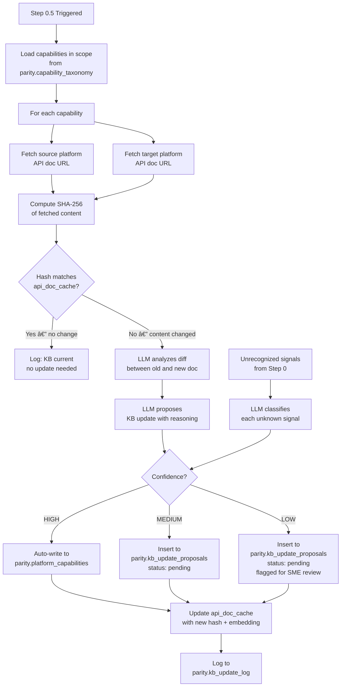
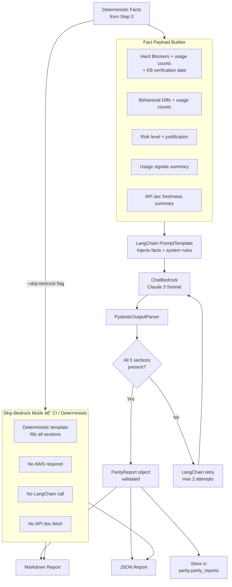
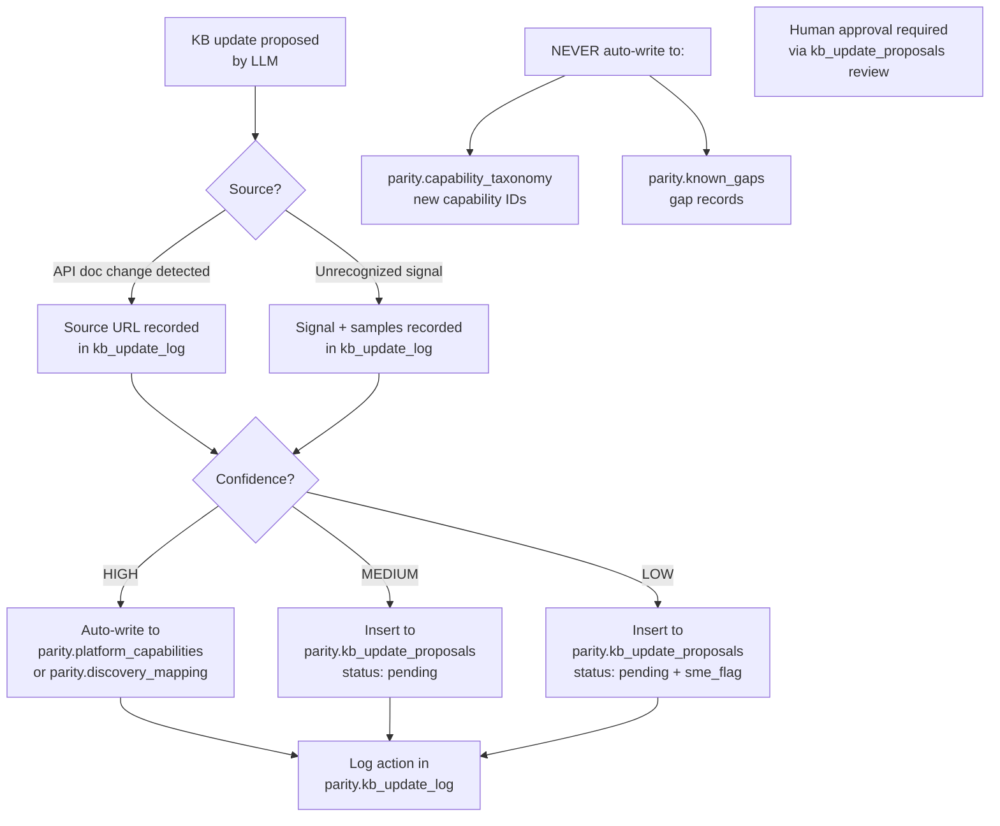

# PACE SCM Migration — Platform Parity Module
## Discovery-Enriched Parity Engine with Live KB Evolution
### Implementation Plan v3.0

**Version:** 3.0
**Date:** 2026-08-12
**Status:** Pre-Implementation Planning
**Scope:** Platform Parity Module — Universal Input, DB-Backed KB,
Live API Documentation Sync, Self-Evolving Knowledge Base
**Author:** Platform Migration Engineering Team

---

## 1. Problem Statement

### 1.1 What the Current System Does

The platform parity system compares two SCM platforms using a static
Knowledge Base and produces reports identifying migration gaps:

> *"Service Desk: HARD\_BLOCKER — GitLab supports it, GitHub does not."*

This is technically correct but operationally insufficient. It fails
to answer the questions that actually drive migration planning:

| Unanswered Question | Why It Matters |
|---|---|
| How many repositories actually use this feature? | 1 repo vs 219 repos requires completely different remediation budgets |
| Which blockers demand immediate action? | Teams cannot plan sprints without urgency ordering |
| Where did that count come from? | Auditors and approvers need traceable evidence |
| What if the input is a PDF, not a CSV? | Static parsers break on any format change |
| What if the platform released a new feature last week? | Static YAML files go stale silently |
| What if the KB is stored in a file on one developer's machine? | No team access, no versioning, no audit trail |

### 1.2 What Changes Are Required

Three specific requirements have been added that fundamentally change
the architecture:

**Requirement 1 — Universal Input**
The input is no longer always a CSV file. It can be a PDF discovery
report, a JSON export, an Excel spreadsheet, plain text, or any other
format a customer provides. The system must handle all of these without
code changes.

**Requirement 2 — Database-Backed Knowledge Base**
The Knowledge Base must be stored in PostgreSQL with pgvector, not in
local YAML files. This enables team access, audit trails, versioning,
semantic search, and eliminates the single-developer dependency on
local file state.

**Requirement 3 — Live API Documentation Sync**
The LLM must fetch the latest API documentation from source and target
SCM platforms, compare it against the current KB, and propose or apply
updates when the platform has changed. The KB must stay current
automatically, not require manual YAML edits.

### 1.3 What the System Will Do After This Plan


ANY INPUT FILE (PDF, CSV, JSON, Excel, text)
↓
Universal Parser extracts repository signals
↓
LLM fetches latest SCM API docs and updates KB in DB
↓
Deterministic engine classifies gaps with real usage impact
↓
LangChain + Claude generates professional narrative
↓
Report shows: gap classification + repo count + urgency + evidence

```
The report transforms from:

Service Desk → HARD_BLOCKER
```

Into:

```
Service Desk → HARD_BLOCKER
219 of 243 repositories affected (90.1%)
Urgency: HIGH
Evidence: service_desk_enabled field (243 rows scanned)
KB last verified: 2026-08-11 (API docs fetched live)
This will break immediately post-migration.
Plan replacement before go-live.
```


---

## 2. Core Architectural Principle

One rule governs every design decision in this system. It must never
be violated:


┌─────────────────────────────────────────────────────────────────┐
│ │
│ DETERMINISTIC ENGINE → DECIDES all migration facts │
│ KB UPDATER + API SYNC → KEEPS knowledge current │
│ CLAUDE via LANGCHAIN → EXPLAINS facts as narrative │
│ │
│ Claude never creates a blocker. │
│ Claude never removes a blocker. │
│ Claude never changes a risk level. │
│ Claude never writes directly to any KB table. │
│ Every number in the report traces back to an input signal. │
│ Every KB update traces back to a source API doc URL. │
│ │
└─────────────────────────────────────────────────────────────────┘

---

## 3. What Changed From v2.0 and Why

| Dimension | v2.0 | v3.0 | Reason |
|---|---|---|---|
| Input format | CSV only | Any file format | Customer inputs are not always CSV |
| KB storage | Local YAML files | PostgreSQL + pgvector | Team access, auditing, semantic search |
| KB updates | From CSV column signals | From live API documentation | KB must stay current automatically |
| Platform detection | Score-based on CSV headers | Score-based + LLM for unstructured | PDF/text files have no headers |
| Signal matching | Exact column name lookup | Vector similarity + exact match | Unstructured inputs need semantic matching |
| Discovery mapping | `discovery_mapping.yaml` | `parity.discovery_mapping` DB table | Moves to DB with rest of KB |
| Report caching | File-based SHA-256 | DB-backed in `parity.parity_reports` | Consistent with DB-first architecture |
| `load_kb.py` | Reads YAML from disk | Queries PostgreSQL | KB is now in DB |
| `export.py` | Writes files only | Writes files + stores in DB | Full result persistence |

---

## 4. Three-Layer Architecture


┌─────────────────────────────────────────────────────────────────────┐
│ PARITY CHECK SYSTEM v3.0 │
├─────────────────────────────────────────────────────────────────────┤
│ │
│ Layer 1 — EVIDENCE (Universal Input + DB Knowledge Base) │
│ ───────────────────────────────────────────────────────── │
│ Real signals extracted from any input format. │
│ Curated, versioned, DB-stored capability declarations. │
│ Live API documentation kept current automatically. │
│ No inference in gap decisions. Ground truth only. │
│ │
│ Layer 2 — LOGIC (Deterministic Comparison Engine) │
│ ───────────────────────────────────────────────── │
│ Structural diff of DB knowledge enriched with usage signals. │
│ Same inputs always produce identical gap analysis. │
│ Auditable, unit-testable. No LLM involved at this layer. │
│ │
│ Layer 3 — NARRATIVE (LangChain + AWS Bedrock Claude) │
│ ──────────────────────────────────────────────────── │
│ LLM receives pre-computed structured facts and generates │
│ human-readable narrative. LLM explains facts. Never decides them. │
│ LangChain enforces structured output via PydanticOutputParser. │
│ │
└─────────────────────────────────────────────────────────────────────┘

---

## 5. Full System Architecture

### 5.1 High-Level Data Flow

```mermaid
flowchart TD
    INPUT[Any Input File\nPDF · CSV · JSON · Excel · Text] --> STEP0

    subgraph STEP0["Step 0 — Universal Document Parser"]
        S0A[Detect file type]
        S0B{Structured format?\nCSV / JSON / Excel}
        S0C[Deterministic Parser\nNo LLM]
        S0D[LangChain Document Loader\nLLM Interpretation]
        S0E[Match signals to KB\nVector similarity + exact]
        S0F[Detect source platform]
        S0G[Flag unrecognized signals]
        S0A --> S0B
        S0B -->|Yes| S0C
        S0B -->|No| S0D
        S0C --> S0E
        S0D --> S0E
        S0E --> S0F --> S0G
    end

    STEP0 --> US[Usage Signals\nrepo_count · percentage\nurgency · evidence]
    STEP0 --> UC[Unrecognized Signals\nnot in KB]

    UC --> STEP05
    US --> STEP05

    subgraph STEP05["Step 0.5 — KB Updater + Live API Doc Sync"]
        K0[For each capability in scope]
        K1[Fetch source SCM API docs]
        K2[Fetch target SCM API docs]
        K3[Compare hash vs api_doc_cache]
        K4{Doc changed?}
        K5[LLM analyzes diff\nproposes KB update]
        K6{Confidence?}
        K7[Auto-write to DB]
        K8[Stage in kb_update_proposals]
        K9[Log to kb_update_log]
        K10[Classify unrecognized signals]
        K0 --> K1 --> K2 --> K3 --> K4
        K4 -->|Yes| K5 --> K6
        K4 -->|No| K9
        K6 -->|HIGH| K7 --> K9
        K6 -->|MEDIUM or LOW| K8 --> K9
        UC --> K10 --> K6
    end

    STEP05 --> STEP1

    subgraph STEP1["Step 1 — Init"]
        I1[SOURCE from Step 0]
        I2[TARGET from user]
        I3[Validate against DB taxonomy]
        I1 --> I2 --> I3
    end

    subgraph STEP2["Step 2 — Load KB from DB"]
        L1[Query capability_taxonomy]
        L2[Query platform_capabilities\nfor source + target]
        L3[Query known_gaps\nfor migration path]
        L4[Vector search for\nrelevant capabilities]
        L1 & L2 & L3 & L4 --> L5[KB Loaded]
    end

    subgraph STEP3["Step 3 — Compare"]
        C1[Deterministic Gap Classification]
        C2[Attach Usage Signals]
        C3[Apply Derived Policy Conditions]
        C4[Usage-aware Risk Weighting]
        C1 --> C2 --> C3 --> C4
    end

    subgraph STEP4["Step 4 — Generate Report"]
        G1[Build Structured Fact Payload]
        G2[LangChain PromptTemplate]
        G3[ChatBedrock — Claude]
        G4[PydanticOutputParser\n5-section enforcement]
        G1 --> G2 --> G3 --> G4
    end

    subgraph STEP5["Step 5 — Export"]
        E1[Write .md to EFS]
        E2[Write .json to EFS]
        E3[Store in parity.parity_reports]
        E1 & E2 & E3 --> E4[Done]
    end

    STEP1 --> STEP2 --> STEP3 --> STEP4 --> STEP5
```



### 5.2 Universal Input Processing Flow



### 5.3 KB Self-Evolution and API Doc Sync Flow



### 5.4 Report Generation — LangChain Pipeline



### 5.5 KB Write Safety Model



## 6. Database Schema

### 6.1 Why PostgreSQL + pgvector

| **Capability** | **PostgreSQL alone** | **PostgreSQL + pgvector** |


Store structured KB records

✅

✅

Exact field lookup by capability ID

✅

✅

API-level audit trail and versioning

✅

✅

Semantic similarity search

❌

✅

Match unstructured PDF signals to capabilities

❌

✅

Store API doc embeddings for change detection

❌

✅

Find related capabilities by meaning not keyword

❌

✅

pgvector enables the system to match an input document that says
"we use pull request approval workflows" to the capability
review.approval_rules without exact keyword matching. This is
essential for unstructured input formats like PDF.

### 6.2 Why Not Local YAML Files

| **Concern** | **YAML Files** | **PostgreSQL** |
| --- | --- | --- |
| Team access | ❌ One developer's machine | ✅ Shared, access-controlled |
| Audit trail | ❌ Git history only | ✅ Full row-level log |

| Concurrent updates | ❌ Merge conflicts | ✅ Transactional |

| Semantic search | ❌ Not possible | ✅ pgvector |

| API doc hash comparison | ❌ Manual | ✅ Automated per row |

| Rollback a bad update | ⚠️ Git revert | ✅ SQL UPDATE / soft delete |

✅ SQL UPDATE / soft delete

Human review workflow

❌ Pull request only

✅ kb_update_proposals table

### 6.3 Full Schema

\\\sql

-- ── SETUP ────────────────────────────────────────────────────────────

CREATE SCHEMA IF NOT EXISTS parity;
CREATE EXTENSION IF NOT EXISTS vector;
CREATE EXTENSION IF NOT EXISTS "uuid-ossp";

-- ── CAPABILITY TAXONOMY ──────────────────────────────────────────────

CREATE TABLE IF NOT EXISTS parity.capability_taxonomy (
    id              UUID        PRIMARY KEY DEFAULT gen_random_uuid(),
    capability_id   TEXT        NOT NULL UNIQUE,
    category        TEXT        NOT NULL,
    display_name    TEXT        NOT NULL,
    description     TEXT,
    embedding       vector(1536),
    created_at      TIMESTAMPTZ NOT NULL DEFAULT NOW(),
    updated_at      TIMESTAMPTZ NOT NULL DEFAULT NOW()
);

COMMENT ON TABLE parity.capability_taxonomy IS
  '54 canonical capability IDs. New entries require human approval only.
   Never auto-written by the KB Updater.';

-- ── PLATFORM CAPABILITIES ────────────────────────────────────────────

CREATE TABLE IF NOT EXISTS parity.platform_capabilities (
    id                  UUID        PRIMARY KEY DEFAULT gen_random_uuid(),
    platform            TEXT        NOT NULL,
    capability_id       TEXT        NOT NULL
                          REFERENCES parity.capability_taxonomy(capability_id),
    supported           BOOLEAN     NOT NULL,
    notes               TEXT,
    workaround          TEXT,
    migration_impact    TEXT,
    confidence          TEXT        NOT NULL DEFAULT 'MEDIUM',
    last_verified       TIMESTAMPTZ,
    verification_source TEXT,
    behavioral_attrs    JSONB       DEFAULT '{}',
    api_doc_snapshot    TEXT,
    api_doc_embedding   vector(1536),
    api_doc_fetched_at  TIMESTAMPTZ,
    created_at          TIMESTAMPTZ NOT NULL DEFAULT NOW(),
    updated_at          TIMESTAMPTZ NOT NULL DEFAULT NOW(),
    UNIQUE(platform, capability_id)
);

COMMENT ON COLUMN parity.platform_capabilities.behavioral_attrs IS
  'Flexible JSONB for platform-specific behavioral attributes:
   max_assignees, strategies, retention_days, etc.';

COMMENT ON COLUMN parity.platform_capabilities.api_doc_snapshot IS
  'Full text of the API documentation page at last_verified time.
   Used for change detection against live fetches.';

-- ── KNOWN GAPS ───────────────────────────────────────────────────────

CREATE TABLE IF NOT EXISTS parity.known_gaps (
    id              UUID        PRIMARY KEY DEFAULT gen_random_uuid(),
    migration_path  TEXT        NOT NULL,
    capability_id   TEXT        NOT NULL
                      REFERENCES parity.capability_taxonomy(capability_id),
    gap_type        TEXT        NOT NULL,
    severity        TEXT        NOT NULL,
    title           TEXT        NOT NULL,
    description     TEXT,
    impact          TEXT,
    workarounds     JSONB       DEFAULT '[]',
    data_migration  TEXT,
    embedding       vector(1536),
    created_at      TIMESTAMPTZ NOT NULL DEFAULT NOW(),
    updated_at      TIMESTAMPTZ NOT NULL DEFAULT NOW(),
    UNIQUE(migration_path, capability_id, gap_type)
);

COMMENT ON TABLE parity.known_gaps IS
  'Curated gap records per migration path.
   New entries require human approval only.
   Never auto-written by the KB Updater.';

-- ── DISCOVERY MAPPING ────────────────────────────────────────────────

CREATE TABLE IF NOT EXISTS parity.discovery_mapping (
    id              UUID        PRIMARY KEY DEFAULT gen_random_uuid(),
    capability_id   TEXT        NOT NULL
                      REFERENCES parity.capability_taxonomy(capability_id),
    signal_name     TEXT        NOT NULL,
    platform        TEXT        NOT NULL,
    detection_rule  TEXT        NOT NULL,
    value_type      TEXT        NOT NULL,
    confidence      TEXT        NOT NULL DEFAULT 'HIGH',
    file_types      TEXT[]      DEFAULT '{}',
    auto_added      BOOLEAN     DEFAULT FALSE,
    added_by        TEXT,
    reasoning       TEXT,
    created_at      TIMESTAMPTZ NOT NULL DEFAULT NOW(),
    updated_at      TIMESTAMPTZ NOT NULL DEFAULT NOW(),
    UNIQUE(capability_id, signal_name, platform)
);

COMMENT ON COLUMN parity.discovery_mapping.file_types IS
  'Which input file types this mapping applies to.
   Empty array means all types.
   Example: {csv, json} means only CSV and JSON inputs.';

COMMENT ON COLUMN parity.discovery_mapping.signal_name IS
  'The field name, column header, key, or extracted concept name
   that maps to this capability.
   For CSV: the column header.
   For JSON: the key path.
   For PDF: the extracted concept label from LLM.';

-- ── KB UPDATE PROPOSALS ──────────────────────────────────────────────

CREATE TABLE IF NOT EXISTS parity.kb_update_proposals (
    id                  UUID        PRIMARY KEY DEFAULT gen_random_uuid(),
    execution_id        TEXT,
    proposal_type       TEXT        NOT NULL,
    capability_id       TEXT,
    platform            TEXT,
    signal_name         TEXT,
    proposed_changes    JSONB       NOT NULL,
    confidence          TEXT        NOT NULL,
    reasoning           TEXT,
    source_doc_url      TEXT,
    source_doc_hash     TEXT,
    status              TEXT        NOT NULL DEFAULT 'pending',
    reviewed_by         TEXT,
    reviewed_at         TIMESTAMPTZ,
    review_notes        TEXT,
    created_at          TIMESTAMPTZ NOT NULL DEFAULT NOW()
);

COMMENT ON COLUMN parity.kb_update_proposals.proposal_type IS
  'One of: new_mapping, capability_update, new_capability, gap_update';

COMMENT ON COLUMN parity.kb_update_proposals.status IS
  'One of: pending, approved, rejected, auto_applied';

-- ── KB UPDATE LOG ────────────────────────────────────────────────────

CREATE TABLE IF NOT EXISTS parity.kb_update_log (
    id              UUID        PRIMARY KEY DEFAULT gen_random_uuid(),
    execution_id    TEXT,
    action_type     TEXT        NOT NULL,
    capability_id   TEXT,
    platform        TEXT,
    signal_name     TEXT,
    confidence      TEXT,
    reasoning       TEXT,
    action_taken    TEXT        NOT NULL,
    source_doc_url  TEXT,
    source_doc_hash TEXT,
    created_at      TIMESTAMPTZ NOT NULL DEFAULT NOW()
);

COMMENT ON TABLE parity.kb_update_log IS
  'Append-only audit log of every KB update event.
   Never truncated or modified. Permanent record.';

-- ── API DOCUMENTATION CACHE ──────────────────────────────────────────

CREATE TABLE IF NOT EXISTS parity.api_doc_cache (
    id              UUID        PRIMARY KEY DEFAULT gen_random_uuid(),
    platform        TEXT        NOT NULL,
    capability_id   TEXT        NOT NULL
                      REFERENCES parity.capability_taxonomy(capability_id),
    doc_url         TEXT        NOT NULL,
    doc_content     TEXT        NOT NULL,
    doc_hash        TEXT        NOT NULL,
    embedding       vector(1536),
    fetched_at      TIMESTAMPTZ NOT NULL DEFAULT NOW(),
    UNIQUE(platform, capability_id)
);

COMMENT ON TABLE parity.api_doc_cache IS
  'Stores the last-known-good API documentation content per platform
   per capability. Used for change detection on subsequent fetches.
   doc_hash is SHA-256 of doc_content for efficient comparison.';

-- ── PARITY REPORT RESULTS ────────────────────────────────────────────

CREATE TABLE IF NOT EXISTS parity.parity_reports (
    id                  UUID        PRIMARY KEY DEFAULT gen_random_uuid(),
    execution_id        TEXT        NOT NULL UNIQUE,
    source_platform     TEXT        NOT NULL,
    target_platform     TEXT        NOT NULL,
    overall_risk        TEXT        NOT NULL,
    gap_count           INTEGER     NOT NULL,
    hard_blocker_count  INTEGER     NOT NULL,
    behavioral_diff_count INTEGER   NOT NULL DEFAULT 0,
    input_file_type     TEXT,
    input_file_name     TEXT,
    total_repos         INTEGER     DEFAULT 0,
    report_markdown     TEXT,
    report_json         JSONB,
    report_hash         TEXT,
    cache_hit           BOOLEAN     DEFAULT FALSE,
    kb_doc_versions     JSONB       DEFAULT '{}',
    created_at          TIMESTAMPTZ NOT NULL DEFAULT NOW()
);

COMMENT ON COLUMN parity.parity_reports.kb_doc_versions IS
  'Snapshot of api_doc_cache.fetched_at per platform+capability
   at the time this report was generated. Enables full traceability
   of which KB version produced this report.';

-- ── INDEXES ──────────────────────────────────────────────────────────

CREATE INDEX IF NOT EXISTS idx_platform_caps_platform
  ON parity.platform_capabilities (platform);

CREATE INDEX IF NOT EXISTS idx_platform_caps_capability
  ON parity.platform_capabilities (capability_id);

CREATE INDEX IF NOT EXISTS idx_platform_caps_confidence
  ON parity.platform_capabilities (confidence);

CREATE INDEX IF NOT EXISTS idx_known_gaps_migration_path
  ON parity.known_gaps (migration_path);

CREATE INDEX IF NOT EXISTS idx_known_gaps_capability
  ON parity.known_gaps (capability_id);

CREATE INDEX IF NOT EXISTS idx_discovery_mapping_platform
  ON parity.discovery_mapping (platform);

CREATE INDEX IF NOT EXISTS idx_discovery_mapping_signal
  ON parity.discovery_mapping (signal_name);

CREATE INDEX IF NOT EXISTS idx_discovery_mapping_file_types
  ON parity.discovery_mapping USING GIN (file_types);

CREATE INDEX IF NOT EXISTS idx_kb_proposals_status
  ON parity.kb_update_proposals (status);

CREATE INDEX IF NOT EXISTS idx_kb_proposals_capability
  ON parity.kb_update_proposals (capability_id);

CREATE INDEX IF NOT EXISTS idx_kb_log_execution
  ON parity.kb_update_log (execution_id);

CREATE INDEX IF NOT EXISTS idx_api_doc_platform_capability
  ON parity.api_doc_cache (platform, capability_id);

CREATE INDEX IF NOT EXISTS idx_parity_reports_execution
  ON parity.parity_reports (execution_id);

CREATE INDEX IF NOT EXISTS idx_parity_reports_platforms
  ON parity.parity_reports (source_platform, target_platform);

-- Vector similarity indexes (HNSW — best for production read performance)
CREATE INDEX IF NOT EXISTS idx_taxonomy_embedding
  ON parity.capability_taxonomy
  USING hnsw (embedding vector_cosine_ops);

CREATE INDEX IF NOT EXISTS idx_known_gaps_embedding
  ON parity.known_gaps
  USING hnsw (embedding vector_cosine_ops);

CREATE INDEX IF NOT EXISTS idx_api_doc_embedding
  ON parity.api_doc_cache
  USING hnsw (embedding vector_cosine_ops);

## 7. Knowledge Base Design

### 7.1 What Was in YAML, Now in DB

Every file that existed in capability_kb/ is now a database table.

Old FileNew DB TableWrite Rules

| **Old File** | **New DB Table** | **Write Rules** |
| --- | --- |


capability_taxonomy.yaml

parity.capability_taxonomy

Human approval only

| platforms/*.yaml | parity.platform_capabilities | Human approval OR HIGH-confidence auto-update from API docs |

| known_gaps.yaml | parity.known_gaps | Human approval only |

| discovery_mapping.yaml | parity.discovery_mapping | Human approval OR HIGH-confidence auto-classification |

| kb_update_proposals.yaml | parity.kb_update_proposals | Written by KB Updater; reviewed by humans |

| kb_update_log.yaml | parity.kb_update_log | Written by KB Updater; never modified |

### 7.2 Discovery Mapping Schema (DB Version)

The parity.discovery_mapping table replaces discovery_mapping.yaml.
Key differences from the YAML version:

signal_name is now format-agnostic — it can be a CSV column name,
a JSON key path, or a concept label extracted from PDF

file_types array indicates which input formats this mapping applies
to (empty = all formats)

auto_added flag indicates whether the row was written by the KB
Updater or by a human

### 7.3 Usage Signal Schema (Unchanged)

Every capability in the pipeline output carries this structure after
Step 0 runs. This schema is unchanged from v2.0 — downstream steps
are unaffected:

JSON

{
  "review.draft_pr": {
    "repo_count": 131,
    "percentage": 53.9,
    "urgency": "HIGH",
    "confidence": "HIGH",
    "total_value": 847,
    "examples": ["repo-alpha", "repo-beta", "repo-gamma"],
    "evidence": {
      "signal_name": "mr_draft_count",
      "detection_rule": "value > 0",
      "value_type": "numeric",
      "file_type": "csv"
    }
  }
}
```

### 7.4 KB Write Safety Rules

| **Table** | **Auto-write Allowed** | **Condition** |


| parity.discovery_mapping | Yes | Confidence HIGH only |

| parity.platform_capabilities | Yes | HIGH-confidence API doc update only |

parity.api_doc_cache

✅ Yes

Always — on every fetch

parity.kb_update_log

✅ Yes

Always — audit trail

parity.kb_update_proposals

✅ Yes

Staging only — not live KB

parity.capability_taxonomy

❌ Never

Human approval required

parity.known_gaps

❌ Never

Human approval required

### 7.5 API Documentation Sources

| **Platform** | **Primary Doc URL Pattern** |
| --- | --- |


| GitLab | https://docs.gitlab.com/ee/api/ |

| GitHub | https://docs.github.com/en/rest |

| Azure DevOps | https://learn.microsoft.com/en-us/rest/api/azure/devops |

| Bitbucket | https://developer.atlassian.com/cloud/bitbucket/rest |

Each capability in parity.platform_capabilities will have a specific
doc URL stored in verification_source. The KB Updater fetches that
URL, computes SHA-256, compares against api_doc_cache.doc_hash, and
triggers an update proposal only when the hash differs.

## 8. Component Specifications

8.1 Step 0 — platform_parity_parse_discovery.py

| **Property** | **Detail** |
| --- | --- |


Type

New script (replaces CSV-only parser)

LLM involved

Yes — for unstructured formats (PDF, text) only

LangChain involved

Yes — Document Loaders + BedrockEmbeddings

Dependencies

csv, json, openpyxl, pypdf, LangChain loaders

Input placeholders

INPUT_FILE_PATH, EXECUTION_ID

Two processing paths:

Path A — Structured (CSV, JSON, Excel):

Deterministic field extraction

Exact match against parity.discovery_mapping table

No LLM call

Same logic as v2.0 CSV parser

Path B — Unstructured (PDF, text, unknown):

LangChain Document Loader extracts text content

Text chunked with RecursiveCharacterTextSplitter

Bedrock Titan generates embeddings per chunk

Vector similarity search against parity.capability_taxonomy

LLM interprets matched sections and extracts signal values

Platform detection:

For structured inputs: score-based detection (unchanged from v2.0)

For unstructured inputs:

text

Step 1: LLM reads document and identifies platform mentions
Step 2: Score-based confirmation on identified signals
Step 3: If score < 60 → RuntimeError (ambiguous)

Output keys (identical to v2.0 — downstream steps unaffected):

| **Key** | **Type** | **Description** |
| --- | --- | --- |


source_platform

string

Detected platform

platform_confidence

string

HIGH / MEDIUM / LOW

platform_evidence

object

Detection signals found

total_repos

int

Repository count (0 if not determinable)

usage_signals

object

capability_id → enriched signal object

unrecognized_signals

list

Signals not matched in DB

column_stats

object

Raw per-signal aggregate stats

input_file_type

string

Detected format: csv/json/pdf/excel/text

8.2 Step 0.5 — platform_parity_kb_updater.py

| **Property** | **Detail** |
| --- | --- |


Type

New script (replaces YAML-writing kb_updater)

LLM involved

Yes — doc analysis + signal classification

LangChain involved

Yes — WebBaseLoader + ChatBedrock + PydanticOutputParser

Triggers

Always runs — API doc sync + unrecognized signal classification

Input placeholders

KB_BASE_PATH, AUTO_UPDATE_THRESHOLD, EXECUTION_ID

DB writes

parity.discovery_mapping, parity.platform_capabilities, parity.api_doc_cache, parity.kb_update_proposals, parity.kb_update_log

Two responsibilities:

Responsibility 1 — Classify Unrecognized Signals

Same as v2.0 KB Updater, now writes to DB instead of YAML:

\\\python
class KBUpdateProposal(BaseModel):
    signal_name: str
    maps_to_capability: str       # existing capability_id or "NEW"
    proposed_capability_id: str   # only if maps_to == "NEW"
    detection_rule: str
    value_type: str
    file_types: List[str]
    confidence: str               # HIGH / MEDIUM / LOW
    reasoning: str

Responsibility 2 — Live API Doc Sync (NEW)

For every capability touched in the current run:

text

1. Look up verification_source URL from parity.platform_capabilities
2. Fetch URL content using LangChain WebBaseLoader
3. Compute SHA-256 of fetched content
4. Compare against parity.api_doc_cache.doc_hash
5. If hash differs:
     a. LLM analyzes: what changed? what does it mean for KB?
     b. LLM proposes specific field updates to platform_capabilities
     c. Confidence scored
     d. HIGH → auto-write to parity.platform_capabilities
     e. MEDIUM/LOW → insert to parity.kb_update_proposals
     f. Update parity.api_doc_cache with new hash + embedding
6. Always log to parity.kb_update_log

LangChain components:

\\\python
from langchain_aws import ChatBedrock, BedrockEmbeddings
from langchain_community.document_loaders import WebBaseLoader
from langchain.prompts import PromptTemplate
from langchain_core.output_parsers import PydanticOutputParser
from langchain.text_splitter import RecursiveCharacterTextSplitter

What the LLM is asked for API doc analysis:

text

Given:
  - Capability: review.approval_rules
  - Platform: GitHub
  - Previous KB entry: { supported: true, notes: "..." }
  - Previous doc content: [old text]
  - New doc content: [new text fetched today]

Answer:
  1. What specific information changed between old and new?
  2. Does this change affect the `supported` field? If yes, new value?
  3. Does this change affect `notes`? If yes, new value?
  4. Does this change affect `workaround`? If yes, new value?
  5. Does this change affect any behavioral_attrs? If yes, which ones?
  6. How confident are you? (HIGH / MEDIUM / LOW)
  7. Explain your reasoning in two sentences.

8.3 Step 1 — platform_parity_init.py (Modified)

Changes from v2.0:

SOURCE_PLATFORM reads from Step 0 output (same as v2.0)

Validates SOURCE and TARGET against parity.capability_taxonomy
(reads from DB, not YAML)

Passes DB connection parameters to downstream steps

8.4 Step 2 — platform_parity_load_kb.py (Modified)

Changes from v2.0:

Reads from parity.* tables instead of YAML files

Uses pgvector similarity search to load most relevant capabilities
for the current migration path

Output structure identical — downstream compare.py unaffected

Python

# Replaces: yaml.safe_load(open("capability_taxonomy.yaml"))
# With:
taxonomy = db_session.execute(
    "SELECT capability_id, category, display_name, description "
    "FROM parity.capability_taxonomy "
    "ORDER BY category, capability_id"
).fetchall()

# Replaces: yaml.safe_load(open(f"platforms/{source}.yaml"))
# With:
source_caps = db_session.execute(
    "SELECT capability_id, supported, notes, workaround, "
    "       confidence, behavioral_attrs "
    "FROM parity.platform_capabilities "
    "WHERE platform = :platform",
    {"platform": source_platform}
).fetchall()

8.5 Step 3 — platform_parity_compare.py (Enhanced)

Changes from v2.0:

Reads usage signals from Step 0 output (unchanged)

Attaches usage signals to gap objects (unchanged)

NEW: Applies derived policy conditions from Step 0

Gap object schema (unchanged from v2.0):\n\n\\\json\n{
  "capability_id": "service_desk",
  "classification": "HARD_BLOCKER",
  "repo_count": 219,
  "repo_percentage": 90.1,
  "urgency": "HIGH",
  "confidence": "HIGH",
  "examples": ["repo-1", "repo-2", "repo-3"],
  "evidence": {
    "signal_name": "service_desk_enabled",
    "detection_rule": "boolean_true",
    "value_type": "boolean",
    "file_type": "csv"
  }
}

Usage-aware risk weighting (unchanged from v2.0):\n\n| **Condition** | **Risk Level** |
| --- | --- |


Hard blocker + usage ≥ 50%

CRITICAL

Hard blocker + usage 10–49%

HIGH

Hard blocker + usage < 10%

HIGH (serious, lower priority)

Behavioral diff + usage ≥ 50%

HIGH

Behavioral diff + usage < 50%

MEDIUM

Partial support only

MEDIUM

All seamless

LOW

8.6 Step 4 — platform_parity_generate_report.py (Modified)

Changes from v2.0:

LangChain chain structure unchanged

Cache now reads/writes parity.parity_reports table (not file cache)

Report includes kb_doc_versions showing which API doc versions
were used

\\\python
from langchain_aws import ChatBedrock
from langchain.prompts import PromptTemplate
from langchain_core.output_parsers import PydanticOutputParser
from langchain_core.runnables import RunnableSequence

class ParityReport(BaseModel):
    executive_summary: str
    hard_blockers_section: str
    behavioral_differences_section: str
    seamless_section: str
    coverage_section: str

chain = PromptTemplate(...) | ChatBedrock(...) | PydanticOutputParser(...)

System instruction (unchanged — Claude explains, never decides):

text

The supplied facts are authoritative.
Do not invent capabilities.
Do not alter classifications.
Do not introduce workarounds not present in the input.
Do not change risk levels.
Your responsibility is explanation only.
Reference repository counts and urgency in every section you write.

8.7 Step 5 — platform_parity_export.py (Modified)

Changes from v2.0:

Writes .md and .json to EFS (unchanged)

NEW: Stores report in parity.parity_reports table

NEW: Stores kb_doc_versions snapshot for traceability

## 9. Complete File Change Register

New Files

| **File** | **Purpose** |
| --- | --- |

Full DB schema — all parity.* tables

| db/migrations/002_seed_from_yaml.py | One-time seed: imports existing YAML data into DB |

scripts/platform_parity_parse_discovery.py

Step 0 — Universal multi-format parser

scripts/platform_parity_kb_updater.py

Step 0.5 — KB updater + live API doc sync

| scripts/platform_parity_db_init.py | Utility: run schema migration + seed |

metadata/platform_parity_parse_discovery.txt

Script descriptor

metadata/platform_parity_kb_updater.txt

Script descriptor

platform_parity_run.py

CLI entry point — accepts any input file

Modified Files

| **File** | **Change** |


scripts/platform_parity_init.py

SOURCE from Step 0; validates against DB

scripts/platform_parity_load_kb.py

Reads from parity.* tables not YAML

scripts/platform_parity_compare.py

Attaches usage signals; applies derived policies

scripts/platform_parity_generate_report.py

LangChain chain; DB cache

scripts/platform_parity_export.py

Stores in parity.parity_reports

workflow/platform_parity_workflow.json

Adds Steps 0 and 0.5; DB connection params

test_bedrock_e2e.py

--input accepts any file; DB mode

Retired Files (Data Migrated to DB)

| **File** | **Replaced By** |


capability_kb/capability_taxonomy.yaml

parity.capability_taxonomy

capability_kb/known_gaps.yaml

parity.known_gaps

capability_kb/platforms/gitlab.yaml

parity.platform_capabilities WHERE platform='gitlab'

capability_kb/platforms/github.yaml

parity.platform_capabilities WHERE platform='github'

capability_kb/platforms/azure_devops.yaml

parity.platform_capabilities WHERE platform='azure_devops'

capability_kb/platforms/bitbucket.yaml

parity.platform_capabilities WHERE platform='bitbucket'

capability_kb/discovery_mapping.yaml

parity.discovery_mapping

These files are not deleted. They are archived to
capability_kb/archive/*** and kept as backup. The pipeline no longer***
reads from them after migration.

## 10. Updated Workflow Definition

JSON

{
  "name": "platform_parity_check",
  "steps": [
    {
      "name": "platform_parity_parse_discovery",
      "values": {
        "INPUT_FILE_PATH": "",
        "DB_CONNECTION_STRING": ""
      }
    },
    {
      "name": "platform_parity_kb_updater",
      "values": {
        "AUTO_UPDATE_THRESHOLD": "HIGH",
        "AWS_REGION": "",
        "DB_CONNECTION_STRING": ""
      }
    },
    {
      "name": "platform_parity_init",
      "values": {
        "TARGET_PLATFORM": "",
        "OUTPUT_FORMAT": "markdown",
        "SCOPE_FILTER": "[]",
        "AWS_REGION": "",
        "BEDROCK_MODEL_ID": "anthropic.claude-3-sonnet-20240229-v1:0",
        "NO_CACHE": false,
        "PROJECT_ID": "",
        "DB_CONNECTION_STRING": ""
      }
    },
    {
      "name": "platform_parity_load_kb"
    },
    {
      "name": "platform_parity_compare"
    },
    {
      "name": "platform_parity_generate_report",
      "activity_options": {
        "start_to_close_seconds": 120,
        "heartbeat_seconds": 30,
        "retry_policy": {
          "maximum_attempts": 2,
          "non_retryable_error_types": ["ScriptNotFoundError"]
        }
      }
    },
    {
      "name": "platform_parity_export"
    }
  ]
}

Key changes from v2.0:
CSV_PATH*** → INPUT_FILE_PATH (accepts any format)***
KB_BASE_PATH*** removed — KB is now in DB***
DB_CONNECTION_STRING*** added to Steps 0, 0.5, and 1***
SOURCE_PLATFORM*** remains absent from init values — comes from Step 0***

## 11. Implementation Phases

Phase 1 — Database Schema and Data Migration

Duration: 2–3 days
Goal: Create all DB tables, indexes, and migrate existing YAML data
LLM involved: No
Dependencies: None — this is the foundation everything else builds on

DeliverableDescription


db/migrations/001_parity_schema.sql

Full schema with all tables, constraints, indexes

db/migrations/002_seed_from_yaml.py

Reads existing YAML files, inserts into DB tables

scripts/platform_parity_db_init.py

Runner: applies migration + seed in correct order

What the seed script does:

Reads capability_taxonomy.yaml → inserts into parity.capability_taxonomy

Reads each platforms/*.yaml → inserts into parity.platform_capabilities

Reads known_gaps.yaml → inserts into parity.known_gaps

Reads discovery_mapping.yaml → inserts into parity.discovery_mapping

Generates embeddings for each record using Bedrock Titan

Moves original YAML files to capability_kb/archive/

Acceptance criteria:

All tables created with correct types, constraints, and indexes

pgvector extension enabled, HNSW indexes created

All 54 capability IDs seeded into taxonomy table

All platform capabilities seeded with correct platform tags

All known gaps seeded with correct migration path values

Embeddings generated and stored for all taxonomy and known gap rows

Original YAML data preserved in archive, not deleted

python scripts/platform_parity_db_init.py --verify passes all checks

Phase 2 — Update Load KB to Read from DB

Duration: 1–2 days
Goal: load_kb.py queries DB; all downstream steps remain unchanged
LLM involved: No
Dependencies: Phase 1

Acceptance criteria:

All KB data comes from parity.* table queries

Output structure identical to current YAML-based output

--skip-bedrock mode works without AWS (DB is always available)

No changes required to compare.py or generate_report.py

Existing test suite passes without modification

Phase 3 — Universal Document Parser (Step 0)

Duration: 3–4 days
Goal: Multi-format input parser producing consistent usage signals
LLM involved: Yes — for unstructured formats only
Dependencies: Phase 1

DeliverableDescription


scripts/platform_parity_parse_discovery.py

Universal parser

metadata/platform_parity_parse_discovery.txt

Script descriptor

Acceptance criteria:

CSV input produces identical output to v2.0 parser

JSON input parsed deterministically without LLM

Excel input parsed deterministically without LLM

PDF input extracts meaningful signals via LangChain + LLM

Plain text input extracts meaningful signals via LangChain + LLM

All output signals matched against parity.discovery_mapping via DB

Unrecognized signals collected and passed to Step 0.5

Platform detection works for all supported formats

--skip-bedrock bypasses LLM path; processes structured formats only

Raises RuntimeError (not sys.exit) on all failure conditions

Phase 4 — KB Updater + Live API Doc Sync (Step 0.5)

Duration: 3–4 days
Goal: Classify unknowns + fetch live API docs + keep KB current
LLM involved: Yes
Dependencies: Phases 1, 3

DeliverableDescription


scripts/platform_parity_kb_updater.py

KB updater with API doc sync

metadata/platform_parity_kb_updater.txt

Script descriptor

Acceptance criteria:

Fetches API docs for all capabilities in current run scope

Correctly detects changed docs via SHA-256 hash comparison

Updates parity.api_doc_cache on every fetch

LLM proposes specific field updates — not vague summaries

HIGH confidence updates auto-written to parity.platform_capabilities

MEDIUM/LOW inserts to parity.kb_update_proposals with status pending

All activity logged to parity.kb_update_log

Graceful fallback when doc URL is unreachable (uses cached version)

Never writes to parity.capability_taxonomy or parity.known_gaps

No-ops cleanly when all docs are fresh and no unrecognized signals

--skip-bedrock skips this step entirely

Phase 5 — Enhance Compare Script

Duration: 1–2 days
Goal: Apply derived policy conditions from Step 0 in gap analysis
LLM involved: No
Dependencies: Phase 3

Acceptance criteria:

All existing gap classification logic completely unchanged

Usage signals attached to gap objects from Step 0

Derived policy conditions evaluated and attached to gap objects

Usage-aware risk weighting applied as per table in Section 8.5

evidence.file_type populated in every gap object

Phase 6 — Enhance Generate Report with LangChain

Duration: 2–3 days
Goal: DB-backed caching; report stored in parity.parity_reports
LLM involved: Yes
Dependencies: Phase 1, Phase 5

Acceptance criteria:

LangChain chain identical to v2.0 (PromptTemplate + ChatBedrock + Pydantic)

Cache check reads parity.parity_reports WHERE report_hash matches

Report stored in parity.parity_reports after generation

kb_doc_versions snapshot stored with every report

--skip-bedrock bypasses LangChain; deterministic template used

All 5 sections enforced by PydanticOutputParser

Phase 7 — Export Update

Duration: 0.5 days
Goal: Export to EFS + store in DB
LLM involved: No
Dependencies: Phase 6

Acceptance criteria:

.md and .json still written to EFS (unchanged)

Report record written to parity.parity_reports

kb_doc_versions included in stored record

Phase 8 — CLI, Workflow, Test Runner

Duration: 1–2 days
Goal: Wire all phases together; update CLI and test runner
Dependencies: All previous phases

DeliverableChange


platform_parity_run.py

--input accepts any file path

workflow/platform_parity_workflow.json

DB params added; Steps 0 and 0.5 added

test_bedrock_e2e.py

--input accepts any file; DB test mode

Expected CLI interaction:

text

$ python platform_parity_run.py --input discovery_report.pdf

Reading input file: discovery_report.pdf
File type detected: PDF

Analyzing document...

  Platform   : GitLab
  Confidence : HIGH
  Evidence   : 15 GitLab platform references found
  Repos      : 243 (extracted from document)

Enter target platform (github / azure_devops / bitbucket): github

Checking KB freshness for GitLab → GitHub...
  review.draft_pr        : KB current (doc unchanged)
  service_desk_enabled   : KB updated (doc changed — HIGH confidence)
  review.approval_rules  : Update staged for review (MEDIUM confidence)

Starting parity analysis: GitLab → GitHub (243 repositories)
Report written to: test_output/gitlab_to_github_a3f9c1.md
Report stored in: parity.parity_reports (id: uuid-...)

Acceptance criteria:

--input accepts CSV, JSON, Excel, PDF, text files

--skip-bedrock works without AWS credentials

Matrix runner run_parity_matrix.py continues to work (input optional)

Existing --source / --target arguments still work for direct invocation

## 12. Technology Stack

ComponentTechnologyRationale


Orchestration

Temporal Workflow

Existing — unchanged

Structured parsing

Python csv, json, openpyxl

Deterministic, no LLM cost for known formats

Unstructured parsing

LangChain Document Loaders

Handles PDF, text, unknown formats uniformly

Signal → capability matching

pgvector similarity search

Semantic matching without exact keywords

KB storage

PostgreSQL + pgvector

Queryable, versionable, auditable, team-accessible

API doc fetching

LangChain WebBaseLoader

Standardized web content extraction

LLM access

AWS Bedrock Claude 3 Sonnet

Enterprise-grade, stays within AWS boundary

Embeddings

AWS Bedrock Titan Embeddings

Same AWS boundary, no external service

LLM orchestration

LangChain

Chains, structured output, retry, document loaders

Output enforcement

Pydantic BaseModel

Structure guaranteed on every LLM response

Report caching

parity.parity_reports DB table

Replaces file-based SHA-256 cache

Doc change detection

SHA-256 + parity.api_doc_cache

Efficient, deterministic, no LLM needed

Python Dependencies

text

# Carried forward from v2.0
langchain>=0.2
langchain-aws
langchain-community
langchain-core

# New in v3.0
langchain-postgres      # pgvector LangChain integration
psycopg2-binary         # PostgreSQL driver
pgvector                # Python pgvector client
openpyxl                # Excel file support
pypdf                   # PDF text extraction
unstructured            # Generic unstructured file parsing

No FAISS. No Chroma. No self-managed vector store.
pgvector runs inside the existing PostgreSQL instance.
No additional infrastructure required.
When the KB grows to 1,000+ capabilities, AWS Bedrock Knowledge Bases
is the recommended managed RAG upgrade path — not a self-hosted store.

## 13. Risks and Mitigations

RiskLikelihoodImpactMitigation


LLM misinterprets unstructured input document

Medium

High

Structured formats always take deterministic path; LLM path outputs confidence score; low confidence signals flagged for review

Live API doc fetch fails (network / rate limit)

Medium

Medium

Cached version used as fallback; retry with exponential backoff; failure logged, pipeline continues

pgvector similarity returns wrong capability match

Low

Medium

Similarity threshold enforced; matches below threshold go to human review staging; exact match tried first

DB migration corrupts existing KB data

Low

High

YAML files archived not deleted; migration is additive only; rollback script provided

API doc content too large for LLM context window

Medium

Medium

RecursiveCharacterTextSplitter chunks docs; only relevant sections sent to LLM

KB auto-update introduces incorrect platform data

Low

High

HIGH confidence threshold only; all writes logged; no auto-deletes ever; human review queue for MEDIUM/LOW

Bedrock outage blocks report generation

Low

Medium

Compare step output (structured JSON) always available; report can be regenerated later

pgvector extension not available on DB instance

Low

High

Verify extension in Phase 1 acceptance criteria; document installation steps in runbook

## 14. Success Metrics

MetricTarget


Input format support

CSV, JSON, Excel, PDF, plain text all produce valid usage signals

KB freshness

API docs checked on every run; staleness detected within 24 hours of platform change

Semantic signal matching precision

≥ 90% of unstructured signals correctly matched to capability IDs

DB query performance

KB load from DB completes in under 2 seconds

Auto-update precision

Zero incorrect HIGH-confidence auto-writes (audited over first 20 production runs)

Report generation time

Under 45 seconds end-to-end including API doc fetch

Skip-bedrock CI mode

Passes in under 10 seconds with no AWS credentials

False negative rate

Zero missed blockers for capabilities in KB with HIGH confidence

Audit traceability

Every KB update links to a specific source doc URL and execution ID

## 15. Future Evolution Path

mermaid

flowchart LR
    subgraph P1["v3.0 — Now"]
        A1[PostgreSQL + pgvector KB]
        A2[Universal input parser]
        A3[Live API doc sync]
        A4[Deterministic Engine]
        A5[Bedrock Narrator\nvia LangChain]
    end

    subgraph P2["v4.0 — KB Growth"]
        B1[1000+ capabilities\n20+ platforms]
        B2[Bedrock Knowledge Base\nManaged RAG]
        B3[Deterministic Engine\nunchanged]
        B4[Bedrock Narrator\nunchanged]
    end

    subgraph P3["v5.0 — Migration Intelligence"]
        C1[Historical migration\noutcome data]
        C2[Predictive risk scoring\nfrom past migrations]
        C3[Automated remediation\nplaybook generation]
        C4[Full migration\norchestration assistant]
    end

    P1 -->|"KB grows beyond ~200 capabilities"| P2
    P2 -->|"Historical outcome data available"| P3

When to upgrade to Bedrock Knowledge Bases:
When the KB grows beyond approximately 200 capabilities across 8+
platforms, or when the API doc corpus becomes too large to fit in
a single LLM context window for comparison, AWS Bedrock Knowledge Bases
is the recommended managed RAG path. It handles ingestion, chunking,
embedding, and retrieval within the AWS boundary — no self-managed
vector infrastructure required.

16. Appendix — Before and After Comparison

Architecture State

Dimensionv1.0 Originalv2.0 CSV-Enrichedv3.0 Universal + DB


Input format

Implicit (no file input)

CSV only

Any file format

KB storage

Local YAML files

Local YAML files

PostgreSQL + pgvector

KB updates

Manual YAML edits

Auto from CSV columns

Auto from live API docs

Platform detection

Manual user input

Score-based from CSV

Score-based + LLM for unstructured

Signal → capability

N/A

Exact column name

Vector similarity + exact

LLM touchpoints

1 (report)

2 (kb_updater + report)

2 (kb_updater + report)

API doc freshness

Never checked

Never checked

Checked every run

Report caching

File-based SHA-256

File-based SHA-256

DB-backed

Audit trail

None

YAML log files

Full DB audit tables

Team access to KB

❌ Local files only

❌ Local files only

✅ Shared DB

Skip-bedrock support

✅

✅

✅

Report Quality

Dimensionv1.0v2.0v3.0


Gap classification

✅ Correct

✅ Correct

✅ Correct (unchanged)

Repository impact

❌ Not shown

✅ From CSV signals

✅ From any input format

Evidence traceability

❌ None

✅ CSV column chain

✅ Signal + file type chain

KB freshness disclosure

❌ Not disclosed

❌ Not disclosed

✅ API doc fetch date shown

Platform detection

❌ Manual

✅ Score-based

✅ Score-based + LLM

Input flexibility

❌ None

❌ CSV only

✅ Any format

KB evolution

❌ Manual only

⚠️ Semi-auto (CSV signals)

✅ Auto from live API docs

Report structure enforcement

⚠️ Post-hoc

✅ PydanticOutputParser

✅ PydanticOutputParser

End of Implementation Plan — Platform Parity Module v3.0

